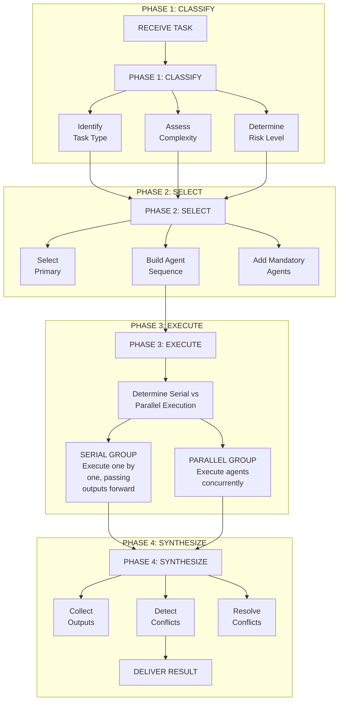
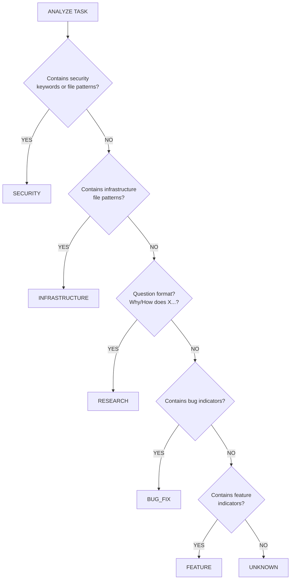
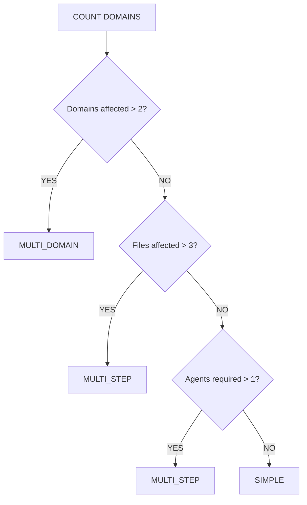
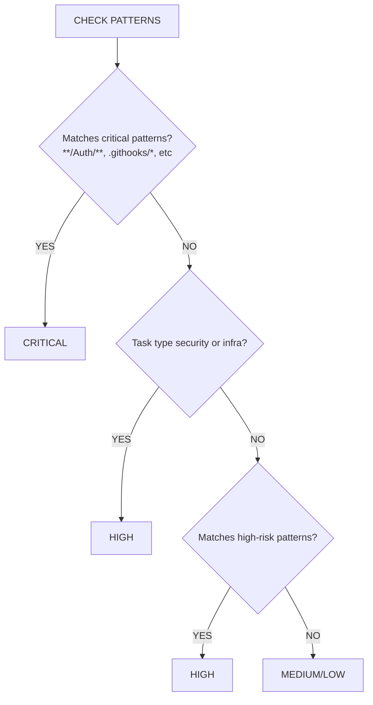
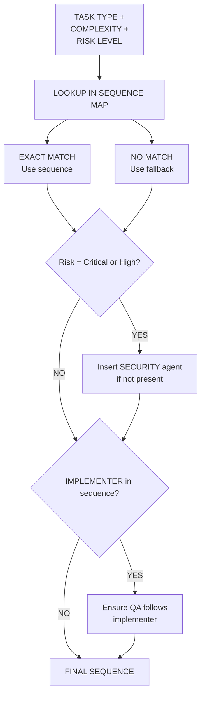
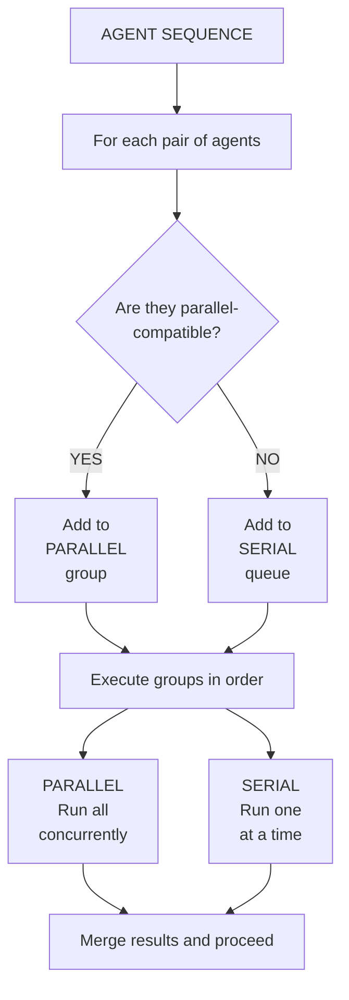
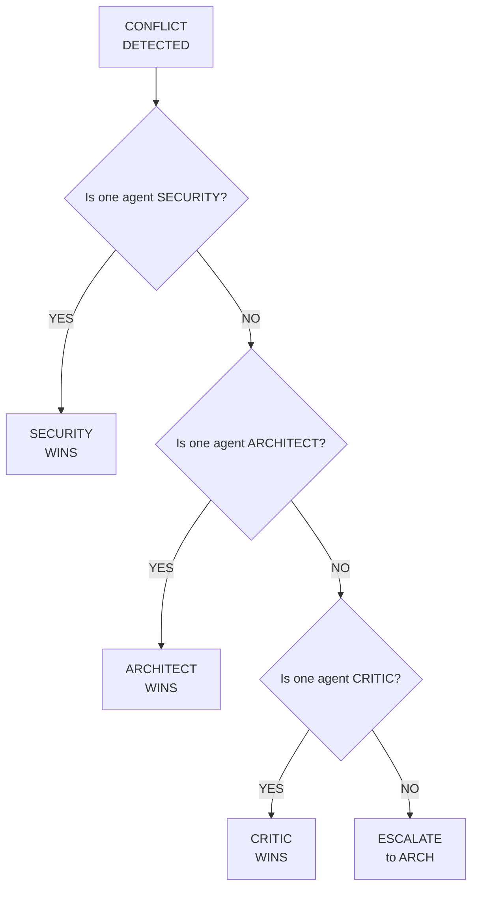
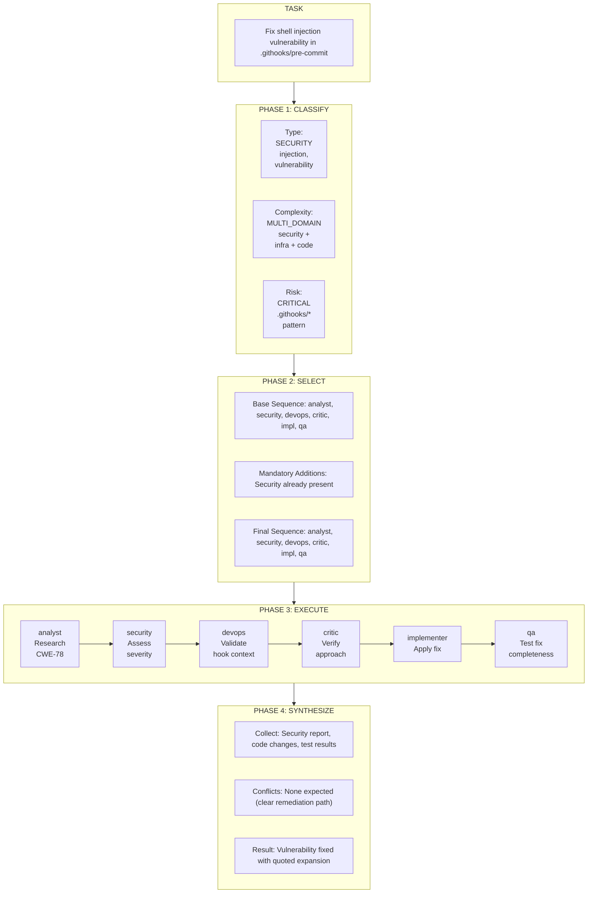

# Orchestrator Routing Flowchart

## Overview

This document provides a visual representation of the orchestrator routing algorithm.

---

## Main Routing Flow

---

## Task Type Classification Flow

---

## Complexity Assessment Flow

---

## Risk Level Flow

---

## Agent Selection Flow

---

## Execution Strategy Flow

---

## Conflict Resolution Flow

---

## Example: CWE-78 Routing

---

## Related Documents

- [Orchestrator Routing Algorithm](./orchestrator-routing-algorithm.md)
- [Task Classification Guide](./task-classification-guide.md)
- [Agent Interview Protocol](../.agents/governance/agent-interview-protocol.md)

---

*Diagram Version: 1.1*
*Created: 2025-12-13*
*Updated: 2025-12-18 - Converted ASCII diagrams to Mermaid*
*GitHub Issue: #5*
