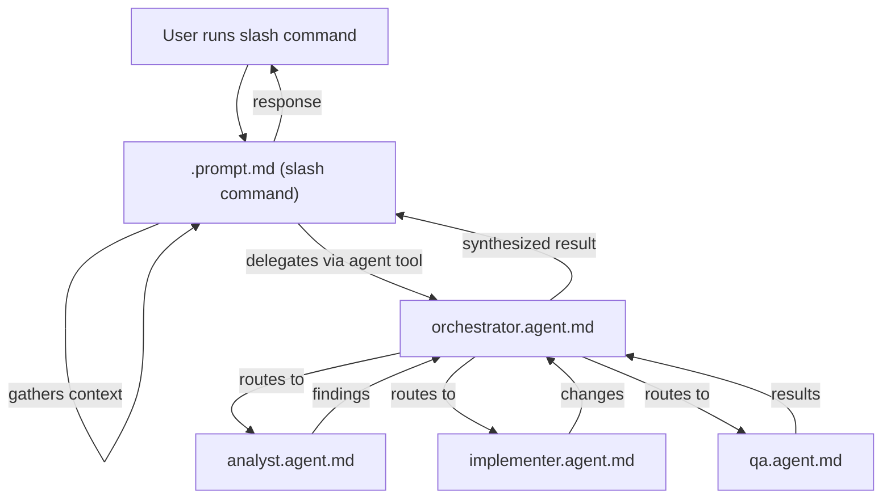
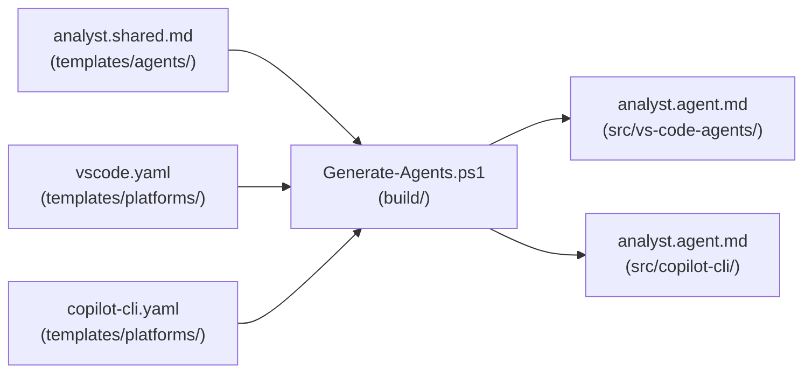

# Prompt Files vs Agent Files

This repository uses two distinct file types to define AI behaviors: `.agent.md` and `.prompt.md`. A third file type, `.shared.md`, serves as the single source of truth from which platform-specific agent files are generated.

## File Types at a Glance

| Aspect | `.agent.md` | `.prompt.md` | `.shared.md` |
|--------|-------------|--------------|--------------|
| Purpose | Defines a runnable agent | Defines a VS Code slash command | Source template for agent generation |
| Frontmatter | `name:`, `tools:`, `model:` | `description:`, `tools:`, `model:` | `description:`, `tools_vscode:`, `tools_copilot:` |
| Model format | `claude-opus-4.5` (SDK) | `Claude Opus 4.5 (anthropic)` (display) | Omitted (injected by generator) |
| Invocation | Called by other agents via `agent` tool | Called by user as slash command (e.g., `/pr-comment-responder 70`) | Not invoked directly |
| Locations | `.github/agents/`, `src/copilot-cli/`, `src/vs-code-agents/` | `.github/prompts/`, `.github/agents/` | `templates/agents/` |
| Can delegate | Yes, to other agents | Yes, via `agent` tool | N/A |

## Why Both Types Exist

Agents cannot invoke other agents directly from user context. The `.prompt.md` slash command solves this. It acts as the user-facing entry point that gathers context, then delegates to one or more `.agent.md` agents using the `agent` tool.

This pattern enables orchestration workflows where a single user action triggers a chain of specialized agents.

## Orchestration Flow



## Concrete Example: PR Comment Responder

The `pr-comment-responder` agent exists in all three forms.

**Slash command** (`.github/agents/pr-comment-responder.prompt.md`):

```yaml
---
description: PR review coordinator who gathers comment context...
argument-hint: Specify the PR number or review comments to address
tools:
  - vscode
  - execute
  - read
  - edit
  - agent
model: Claude Opus 4.5 (anthropic)
---
```

The user runs `/pr-comment-responder 70`. The slash command gathers PR metadata and comment context. It then delegates to the orchestrator agent for analysis and implementation.

**Agent** (`.github/agents/pr-comment-responder.agent.md`):

```yaml
---
name: pr-comment-responder
description: PR review coordinator who gathers comment context...
argument-hint: Specify the PR number or review comments to address
tools:
  - shell
  - read
  - edit
  - agent
model: claude-opus-4.5
---
```

This agent is callable by other agents. The orchestrator can route work to it. It uses `shell` instead of `vscode`/`execute` because it runs in CLI context.

## Generation Pipeline

Shared templates in `templates/agents/` contain the prompt body and platform-neutral frontmatter. The `build/Generate-Agents.ps1` script reads each `.shared.md` file, applies platform-specific transformations, and writes the output files.



### What the Generator Transforms

| Aspect | VS Code Output | Copilot CLI Output |
|--------|---------------|-------------------|
| `name:` field | Omitted | Included |
| `model:` value | `Claude Opus 4.5 (copilot)` | `claude-opus-4.5` |
| Tools array | Expanded from `tools_vscode` | Expanded from `tools_copilot` |
| Handoff syntax | `#runSubagent` | `/agent` |
| Memory prefix | `serena/` | `serena/` |

### Shared Template Frontmatter

Shared templates use platform-keyed tool arrays. The generator selects the correct array for each platform.

```yaml
---
description: Research and investigation specialist...
tools_vscode:
  - $toolset:editor
  - $toolset:github-research
tools_copilot:
  - $toolset:editor
  - $toolset:github-research
---
```

Toolset references (`$toolset:editor`) are expanded from `templates/toolsets.yaml` into their platform-specific tool lists.

## Prompt Files in `.github/prompts/`

These define standalone VS Code slash commands. They do not use the `agent` tool. For example, `.github/prompts/pr-quality.all.prompt.md` runs as `/pr-quality:all` and executes six review agents sequentially against your working directory.

The `.github/agents/` directory contains both `.agent.md` and `.prompt.md` files. The `.agent.md` files are primary agent definitions for GitHub Copilot CLI. The `.prompt.md` file (`pr-comment-responder.prompt.md`) provides the slash command entry point for orchestration.

## When to Create Each Type

| You want to... | Create a... |
|----------------|-------------|
| Add a new specialized agent | `.shared.md` in `templates/agents/`, then run `Generate-Agents.ps1` |
| Add a user-facing slash command | `.prompt.md` in `.github/prompts/` or `.github/agents/` |
| Add an orchestration entry point | `.prompt.md` that delegates to agents via the `agent` tool |
| Modify agent behavior | Edit the `.shared.md` source, then regenerate |

## Validation

Run the generator in validate mode to verify generated files match their templates:

```bash
pwsh build/Generate-Agents.ps1 -Validate
```

This compares each generated file against what the current templates would produce. CI runs this check to prevent drift between templates and generated output.
