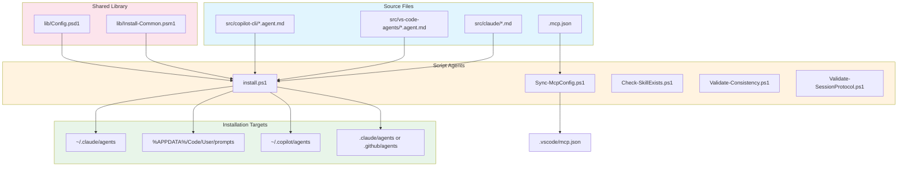
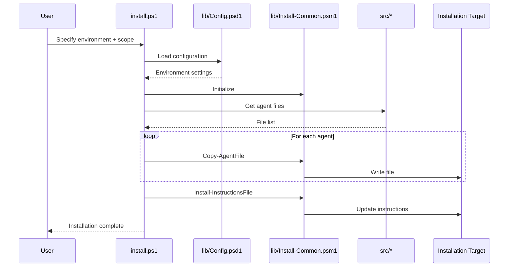

# Scripts Directory: Agents and Coding Standards

> **Scope**: Scripts directory. Auto-loaded when working in `scripts/`.
> **Primary Reference**: Root CLAUDE.md and AGENTS.md take precedence.

This document contains PowerShell coding standards and describes the automated actors that handle agent installation, configuration sync, and validation utilities.

---

## PowerShell Coding Standards

### Language Constraint

**PowerShell only** (.ps1/.psm1) per ADR-005.

No bash or Python scripts in this directory. Cross-platform consistency via PowerShell.

### Script Structure

```powershell
<#
.SYNOPSIS
Brief description

.PARAMETER ParamName
Parameter description

.EXAMPLE
Example usage

.NOTES
    EXIT CODES:
    0  - Success: Operation completed
    1  - Error: Validation/logic failure
    2  - Error: Missing required parameter
    3  - Error: GitHub API error
    4  - Error: Authentication failure

    See ADR-035 for complete reference.
#>
[CmdletBinding()]
param(
    [Parameter(Mandatory)]
    [string]$RequiredParam,

    [string]$OptionalParam
)

$ErrorActionPreference = 'Stop'

# Functions
function Verb-Noun {
    [CmdletBinding()]
    param()

    # Implementation
}

# Main logic
try {
    Verb-Noun
    exit 0
} catch {
    Write-Error $_.Exception.Message
    exit 1
}
```

### Naming Conventions

- Scripts: `Verb-Noun.ps1` (PascalCase, approved verbs)
- Functions: `Verb-Noun` (PascalCase, approved verbs)
- Variables: `$camelCase` or `$PascalCase` for exported
- Parameters: `$PascalCase`

### Error Handling Pattern

```powershell
$ErrorActionPreference = 'Stop'  # Fail fast

try {
    # Operations
    exit 0  # Success
} catch {
    Write-Error $_.Exception.Message
    exit 1  # Failure
}
```

### Cross-Platform Patterns

```powershell
# Path separators
$path = Join-Path $dir $file  # Not "$dir/$file"

# Line endings
Get-Content -Raw  # Preserves line endings

# Case sensitivity
Use [StringComparison]::OrdinalIgnoreCase for comparisons
```

### Testing Standards

- Pester tests in `tests/` or adjacent to scripts
- Test isolation: No global state
- Parameterized tests: `@()` arrays
- CI validation: All tests run on push

### Module Structure

```powershell
# {Module}.psm1
function Export-Function1 { }
function Export-Function2 { }

Export-ModuleMember -Function Export-Function1, Export-Function2
```

### Security

- No secrets in scripts (use environment variables or parameters)
- Validate input at system boundaries
- Use approved parameter sets for mutually exclusive options

### Related References

- Exit codes: `.agents/architecture/ADR-035-exit-code-standardization.md`
- Skill development: `.claude/skills/CLAUDE.md`
- ADR-005: PowerShell-only architecture

---

## Installation & Utility Agents

## Overview

The `scripts/` directory contains PowerShell scripts that automate installation of AI agents to different platforms, synchronize MCP configurations, and validate session protocol compliance.

## Architecture



## Agent Catalog

### install.ps1 (Unified Installer)

**Role**: Single entry point for all agent installations

| Attribute | Value |
|-----------|-------|
| **Input** | Environment, scope parameters |
| **Output** | Installed agent files |
| **Trigger** | Manual, remote execution |
| **Dependencies** | `lib/Install-Common.psm1`, `lib/Config.psd1` |

**Parameters**:

| Parameter | Type | Description |
|-----------|------|-------------|
| `-Environment` | String | `Claude`, `Copilot`, or `VSCode` |
| `-Global` | Switch | Install to user-level location |
| `-RepoPath` | String | Install to specified repository |
| `-Version` | String | Version tag or branch (default: `v0.1.0`) |
| `-Force` | Switch | Overwrite without prompting |

**Invocation**:

```powershell
# Remote installation (stable release v0.1.0)
iex ((New-Object System.Net.WebClient).DownloadString(
  'https://raw.githubusercontent.com/rjmurillo/ai-agents/v0.1.0/scripts/install.ps1'))

# Remote installation (bleeding edge from main)
iex ((New-Object System.Net.WebClient).DownloadString(
  'https://raw.githubusercontent.com/rjmurillo/ai-agents/main/scripts/install.ps1'))

# Local installation
.\install.ps1 -Environment Claude -Global
.\install.ps1 -Environment VSCode -RepoPath "C:\MyRepo"
.\install.ps1 -Environment Copilot -RepoPath "." -Force

# Local installation with specific version
.\install.ps1 -Environment Claude -Global -Version "main"
```

**Installation Matrix**:

| Environment | Global Location | Repo Location |
|-------------|-----------------|---------------|
| Claude | `~/.claude/agents` | `.claude/agents` |
| VSCode | `%APPDATA%/Code/User/prompts` | `.github/agents` |
| Copilot | `~/.copilot/agents` | `.github/agents` |

---

### Legacy Installation Scripts

For backward compatibility, individual scripts wrap the unified installer:

| Script | Equivalent |
|--------|------------|
| `install-claude-global.ps1` | `install.ps1 -Environment Claude -Global` |
| `install-claude-repo.ps1` | `install.ps1 -Environment Claude -RepoPath <path>` |
| `install-copilot-cli-global.ps1` | `install.ps1 -Environment Copilot -Global` |
| `install-copilot-cli-repo.ps1` | `install.ps1 -Environment Copilot -RepoPath <path>` |
| `install-vscode-global.ps1` | `install.ps1 -Environment VSCode -Global` |
| `install-vscode-repo.ps1` | `install.ps1 -Environment VSCode -RepoPath <path>` |

---

### Sync-McpConfig.ps1

**Role**: MCP configuration synchronizer between Claude and VS Code

| Attribute | Value |
|-----------|-------|
| **Input** | `.mcp.json` (Claude Code format) |
| **Output** | `.vscode/mcp.json` (VS Code format) |
| **Trigger** | Manual |
| **Dependencies** | PowerShell 7.0+ |

**Transformations Applied**:

| From (Claude) | To (VS Code) |
|---------------|--------------|
| Root key `mcpServers` | Root key `servers` |
| Serena `--context "claude-code"` | `--context "ide"` |
| Serena `--port "24282"` | `--port "24283"` |

**Invocation**:

```powershell
# Sync with default paths
.\Sync-McpConfig.ps1

# Preview changes
.\Sync-McpConfig.ps1 -WhatIf

# Force overwrite
.\Sync-McpConfig.ps1 -Force
```

---

### Check-SkillExists.ps1

**Role**: Skill existence verification for Phase 1.5 BLOCKING gate

| Attribute | Value |
|-----------|-------|
| **Input** | Operation type, action name |
| **Output** | Boolean result or skill list |
| **Trigger** | Session protocol validation |
| **Dependencies** | `.claude/skills/` directory |

**Invocation**:

```powershell
# Check for specific skill
.\Check-SkillExists.ps1 -Operation "pr" -Action "PRContext"  # Returns: $true

# List all available skills
.\Check-SkillExists.ps1 -ListAvailable
```

**Parameters**:

| Parameter | Values | Description |
|-----------|--------|-------------|
| `-Operation` | `pr`, `issue`, `reactions`, `label`, `milestone` | Skill category |
| `-Action` | String | Substring match against script names |
| `-ListAvailable` | Switch | List all skills organized by type |

---

### Validate-Consistency.ps1

**Role**: Cross-document consistency validator

| Attribute | Value |
|-----------|-------|
| **Input** | `.agents/` directory artifacts |
| **Output** | Consistency report |
| **Trigger** | Manual, CI |
| **Dependencies** | PowerShell 7.0+ |

**Validations**:

- Naming convention compliance
- Cross-reference integrity
- Requirement coverage

---

### Validate-SessionProtocol.ps1

**Role**: Session protocol compliance checker

| Attribute | Value |
|-----------|-------|
| **Input** | Session logs in `.agents/sessions/` |
| **Output** | Protocol compliance report |
| **Trigger** | CI on session log changes |
| **Dependencies** | PowerShell 7.0+ |

**Checks Performed**:

| Check | Level | Description |
|-------|-------|-------------|
| Session log exists | MUST | File at correct path with naming |
| Protocol Compliance section | MUST | Section present in log |
| MUST requirements completed | MUST | All mandatory items checked |
| HANDOFF.md updated | MUST | Modified timestamp recent |
| SHOULD requirements | SHOULD | Warnings (not errors) |

**Invocation**:

```powershell
# Validate specific session
.\Validate-SessionProtocol.ps1 -SessionDate "2025-12-18" -SessionNumber 24

# CI mode
.\Validate-SessionProtocol.ps1 -CI

# JSON output
.\Validate-SessionProtocol.ps1 -OutputFormat JSON
```

---

## Shared Library

### lib/Install-Common.psm1

Shared functions used by all installation scripts:

| Function | Purpose |
|----------|---------|
| `Get-InstallConfig` | Load environment/scope configuration |
| `Resolve-DestinationPath` | Expand path expressions |
| `Test-SourceDirectory` | Validate source exists |
| `Get-AgentFiles` | Find agent files by pattern |
| `Initialize-Destination` | Create destination directory |
| `Test-GitRepository` | Check if path is git repo |
| `Initialize-AgentsDirectories` | Create `.agents/` subdirectories |
| `Copy-AgentFile` | Copy single agent with prompting |
| `Install-InstructionsFile` | Install/upgrade instructions |
| `Write-InstallHeader` | Display installation header |
| `Write-InstallComplete` | Display completion message |

### lib/Config.psd1

Environment-specific configuration:

```powershell
@{
    _Common = @{
        BeginMarker = "<!-- BEGIN: ai-agents installer -->"
        EndMarker = "<!-- END: ai-agents installer -->"
        AgentsDirs = @(".agents/analysis", ".agents/planning", ...)
    }

    Claude = @{
        DisplayName = "Claude Code"
        SourceDir = "src/claude"
        FilePattern = "*.md"
        Global = @{ DestDir = '$HOME/.claude/agents' }
        Repo = @{ DestDir = '.claude/agents' }
    }

    # VSCode, Copilot configurations...
}
```

---

## Data Flow



## Error Handling

| Agent | Error Scenario | Behavior |
|-------|---------------|----------|
| install.ps1 | Source not found | Exit with path error |
| install.ps1 | Permission denied | Prompt for elevated permissions |
| install.ps1 | File exists | Prompt unless `-Force` |
| Sync-McpConfig.ps1 | Source missing | Exit with path error |
| Validate-SessionProtocol.ps1 | Session not found | Warning, continue |

## Security Considerations

| Agent | Security Control |
|-------|-----------------|
| install.ps1 | Path validation prevents traversal |
| install.ps1 | Remote execution uses HTTPS only |
| Sync-McpConfig.ps1 | No external network access |
| All scripts | No credential handling |

## Testing

Tests are located in `scripts/tests/`:

| Test File | Coverage |
|-----------|----------|
| `Install-Common.Tests.ps1` | All 11 module functions |
| `Config.Tests.ps1` | Configuration validation |
| `install.Tests.ps1` | Entry point parameter validation |
| `Sync-McpConfig.Tests.ps1` | MCP sync transformations |
| `Validate-SessionProtocol.Tests.ps1` | Protocol validation logic |

**Running Tests**:

```powershell
# All tests
Invoke-Pester -Path .\scripts\tests

# Specific file
Invoke-Pester -Path .\scripts\tests\Install-Common.Tests.ps1

# Detailed output
Invoke-Pester -Path .\scripts\tests -Output Detailed
```

## Monitoring

| Agent | CI Workflow | Trigger |
|-------|------------|---------|
| install.ps1 | `pester-tests.yml` | PR to `scripts/**` |
| Sync-McpConfig.ps1 | `pester-tests.yml` | PR to `scripts/**` |
| Validate-SessionProtocol.ps1 | `ai-session-protocol.yml` | PR to `.agents/**` |

## Related Documentation

- [scripts/README.md](README.md) - Installation guide
- [build/AGENTS.md](../build/AGENTS.md) - Build automation agents
- [.github/AGENTS.md](../.github/AGENTS.md) - GitHub Actions agents
