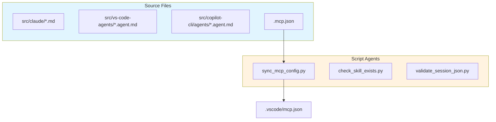

# Scripts Directory: Agents and Coding Standards

> **Scope**: Scripts directory. Auto-loaded when working in `scripts/`.
> **Primary Reference**: Root CLAUDE.md and AGENTS.md take precedence.

This document contains PowerShell coding standards and describes the automated actors that handle agent installation, configuration sync, and validation utilities.

---

## PowerShell Coding Standards

### Language Constraint

**Python-first** (.py) per ADR-042, which supersedes ADR-005 for new development.

New scripts use Python. No bash scripts (.sh). ADR-005 originally mandated
PowerShell-only; the repository has since completed the ADR-042 migration and
retains zero PowerShell files. The PowerShell coding standards below are kept
for historical reference and any reintroduced `.ps1` tooling. For new work,
follow the Python guidance in
[`.agents/guides/python-for-powershell-developers.md`](../.agents/guides/python-for-powershell-developers.md).

### Script Structure

```powershell
<#
.SYNOPSIS
Brief description

.PARAMETER ParamName
Parameter description

.EXAMPLE
Example usage

.NOTES
    EXIT CODES:
    0  - Success: Operation completed
    1  - Error: Validation/logic failure
    2  - Error: Missing required parameter
    3  - Error: GitHub API error
    4  - Error: Authentication failure

    See ADR-035 for complete reference.
#>
[CmdletBinding()]
param(
    [Parameter(Mandatory)]
    [string]$RequiredParam,

    [string]$OptionalParam
)

$ErrorActionPreference = 'Stop'

# Functions
function Verb-Noun {
    [CmdletBinding()]
    param()

    # Implementation
}

# Main logic
try {
    Verb-Noun
    exit 0
} catch {
    Write-Error $_.Exception.Message
    exit 1
}
```

### Naming Conventions

- Scripts: `Verb-Noun.ps1` (PascalCase, approved verbs)
- Functions: `Verb-Noun` (PascalCase, approved verbs)
- Variables: `$camelCase` or `$PascalCase` for exported
- Parameters: `$PascalCase`

### Error Handling Pattern

```powershell
$ErrorActionPreference = 'Stop'  # Fail fast

try {
    # Operations
    exit 0  # Success
} catch {
    Write-Error $_.Exception.Message
    exit 1  # Failure
}
```

### Cross-Platform Patterns

```powershell
# Path separators
$path = Join-Path $dir $file  # Not "$dir/$file"

# Line endings
Get-Content -Raw  # Preserves line endings

# Case sensitivity
Use [StringComparison]::OrdinalIgnoreCase for comparisons
```

### Testing Standards

- pytest tests in `tests/`
- Test isolation: No global state
- Parameterized tests: `@pytest.mark.parametrize`
- CI validation: All tests run on push

### Module Structure

```python
# {module}.py
def function1(): ...
def function2(): ...

__all__ = ["function1", "function2"]
```

### Security

- No secrets in scripts (use environment variables or parameters)
- Validate input at system boundaries
- Use approved parameter sets for mutually exclusive options

### Related References

- Exit codes: `.agents/architecture/ADR-035-exit-code-standardization.md`
- Skill development: `.claude/skills/CLAUDE.md`
- ADR-005: PowerShell-only architecture (superseded by ADR-042)
- ADR-042: Python migration strategy

---

## Installation & Utility Agents

## Overview

The `scripts/` directory contains PowerShell scripts that automate installation of AI agents to different platforms, synchronize MCP configurations, and validate session protocol compliance.

## Architecture


```mermaid
flowchart TD
    subgraph Sources["Source Files"]
        SC[src/claude/*.md]
        SV[src/vs-code-agents/*.agent.md]
        SCP[src/copilot-cli/agents/*.agent.md]
        MCP[.mcp.json]
    end

    subgraph Scripts["Script Agents"]
        SYN[sync_mcp_config.py]
        CHK[check_skill_exists.py]
        VSP[validate_session_json.py]
    end

    MCP --> SYN
    SYN --> VSC[.vscode/mcp.json]

    style Sources fill:#e1f5fe
    style Scripts fill:#fff3e0
```

> **Note**: Agent installation is handled through each tool's native marketplace support.
> See [docs/installation.md](../docs/installation.md) for installation instructions.

## Agent Catalog

### sync_mcp_config.py

**Role**: MCP configuration synchronizer between Claude and VS Code

| Attribute | Value |
|-----------|-------|
| **Input** | `.mcp.json` (Claude Code format) |
| **Output** | `.vscode/mcp.json` (VS Code format) |
| **Trigger** | Manual |
| **Dependencies** | Python 3.12+ |

**Transformations Applied**:

| From (Claude) | To (VS Code) |
|---------------|--------------|
| Root key `mcpServers` | Root key `servers` |
| Serena `--context "claude-code"` | `--context "ide"` |
| Serena `--port "24282"` | `--port "24283"` |

**Invocation**:

```bash
# Sync to both VS Code and Factory
python3 -m scripts.sync_mcp_config --sync-all

# Preview changes
python3 -m scripts.sync_mcp_config --sync-all --dry-run

# Force overwrite
python3 -m scripts.sync_mcp_config --sync-all --force
```

---

### check_skill_exists.py

**Role**: Skill existence verification for Phase 1.5 BLOCKING gate

| Attribute | Value |
|-----------|-------|
| **Input** | Operation type, action name |
| **Output** | Boolean result or skill list |
| **Trigger** | Session protocol validation |
| **Dependencies** | `.claude/skills/` directory |

**Invocation**:

```bash
# Check for specific skill (exit 0 = found, exit 1 = not found)
python3 scripts/check_skill_exists.py --operation pr --action PRContext

# List all available skills
python3 scripts/check_skill_exists.py --list-available
```

**Parameters**:

| Parameter | Values | Description |
|-----------|--------|-------------|
| `--operation` | `pr`, `issue`, `reactions`, `label`, `milestone` | Skill category |
| `--action` | String | Substring match against script names |
| `--list-available` | Switch | List all skills organized by type |

---

### validate_session_json.py

**Role**: Session log validator (schema shape + protocol meaning)

| Attribute | Value |
|-----------|-------|
| **Input** | A session log JSON handed to it (the call site passes logs changed on the branch) |
| **Output** | Protocol compliance report |
| **Trigger** | `session-policy` pre-commit hook (validate-if-present), on demand |
| **Dependencies** | Python 3.10+ |

**Checks Performed** (only against a staged or handed log; a log is optional):

| Check | Level | Description |
|-------|-------|-------------|
| Schema shape | MUST | Fields, types, ranges per `.agents/schemas/session-log.schema.json` |
| MUST checklist complete | MUST | Each MUST item marked done with non-empty evidence |
| Branch and SHA format | MUST | Branch name and commit SHA look valid |
| `endingCommit` reachable | SHOULD | Warning, not an error |

**Invocation**:

```bash
# Validate specific session
uv run python scripts/validate_session_json.py .agents/sessions/2025-12-18-session-24.json

# Pre-commit mode
uv run python scripts/validate_session_json.py .agents/sessions/2025-12-18-session-24.json --pre-commit
```

---

## Error Handling

| Agent | Error Scenario | Behavior |
|-------|---------------|----------|
| sync_mcp_config.py | Source missing | Exit with path error |
| validate_session_json.py | Session not found | Warning, continue |

## Security Considerations

| Agent | Security Control |
|-------|-----------------|
| sync_mcp_config.py | No external network access |
| All scripts | No credential handling |
| All scripts | Path validation prevents traversal |

## Testing

Tests are located in `tests/`:

| Test File | Coverage |
|-----------|----------|
| `test_sync_mcp_config.py` | MCP sync transformations |
| `test_validate_session_json.py` | Session protocol validation |

**Running Tests**:

```bash
# All tests
uv run pytest

# Specific file
uv run pytest tests/test_sync_mcp_config.py

# Detailed output
uv run pytest -vv
```

## Monitoring

| Agent | CI Workflow | Trigger |
|-------|------------|---------|
| sync_mcp_config.py | `pytest.yml` | PR to `scripts/**` |
| validate_session_json.py | `session-policy` pre-commit (`git_hook_policy.py session`), on demand | Staged session log (validate-if-present) |

## Related Documentation

- [scripts/README.md](README.md) - Installation guide
- [build/AGENTS.md](../build/AGENTS.md) - Build automation agents
- [.github/AGENTS.md](../.github/AGENTS.md) - GitHub Actions agents
