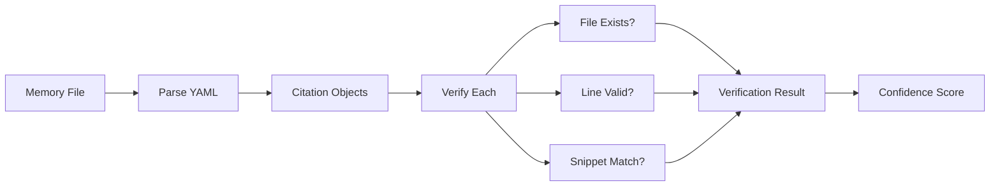

# Memory Enhancement Layer

Citation verification and graph traversal for Serena + Forgetful memories.

## Overview

The Memory Enhancement Layer adds structured code references to Serena memories, inspired by GitHub Copilot's citation system. It provides:

- **Citation Schema**: YAML frontmatter with file:line references
- **Just-in-Time Verification**: Detect stale citations without continuous sync
- **CLI Interface**: Verify individual memories or entire directories
- **Foundation**: Enables future graph traversal and health reporting

## Installation

```bash
# Install dependencies
uv pip install -e ".[dev]"
# or
pip install -e ".[dev]"
```

## Usage

### Verify a Single Memory

```bash
# By memory ID (searches .serena/memories/)
PYTHONPATH=scripts:$PYTHONPATH python -m memory_enhancement verify memory-001-feedback-retrieval

# By file path
PYTHONPATH=scripts:$PYTHONPATH python -m memory_enhancement verify .serena/memories/memory-001-feedback-retrieval.md

# JSON output
PYTHONPATH=scripts:$PYTHONPATH python -m memory_enhancement verify memory-001 --json
```

Output:

```text
✅ VALID - memory-001-feedback-retrieval
Confidence: 100.0%
Citations: 3/3 valid
```

or:

```text
❌ STALE - memory-001-feedback-retrieval
Confidence: 66.7%
Citations: 2/3 valid

Stale citations:
  - scripts/old-file.py:15
    Reason: File not found: scripts/old-file.py
```

### Verify All Memories

```bash
# Default directory (.serena/memories)
PYTHONPATH=scripts:$PYTHONPATH python -m memory_enhancement verify-all

# Custom directory
PYTHONPATH=scripts:$PYTHONPATH python -m memory_enhancement verify-all --dir path/to/memories

# JSON output
PYTHONPATH=scripts:$PYTHONPATH python -m memory_enhancement verify-all --json
```

Output:

```text
Verified 42 memories: 38 valid, 4 stale

Stale memories:

❌ STALE - memory-015-git-hooks
Confidence: 50.0%
Citations: 1/2 valid

Stale citations:
  - scripts/hooks/pre-commit.py:23
    Reason: Line 23 exceeds file length (20 lines)
```

### Traverse Memory Graph

```bash
# Traverse from a root memory (BFS by default)
PYTHONPATH=scripts:$PYTHONPATH python -m memory_enhancement graph memory-001

# Use DFS traversal
PYTHONPATH=scripts:$PYTHONPATH python -m memory_enhancement graph memory-001 --strategy dfs

# Limit traversal depth
PYTHONPATH=scripts:$PYTHONPATH python -m memory_enhancement graph memory-001 --max-depth 3

# Filter by link types
PYTHONPATH=scripts:$PYTHONPATH python -m memory_enhancement graph memory-001 --link-types related,implements

# Find all root memories (no incoming links)
PYTHONPATH=scripts:$PYTHONPATH python -m memory_enhancement graph find-roots

# JSON output
PYTHONPATH=scripts:$PYTHONPATH python -m memory_enhancement graph memory-001 --json
```

Output:

```text
Graph traversal from: memory-001-feedback-retrieval
Strategy: BFS
Max depth reached: 2
Nodes visited: 5

Traversal tree:
- memory-001-feedback-retrieval
  - adr-007-memory-first (IMPLEMENTS)
  - memory-observations (RELATED)
    - memory-token-efficiency (RELATED)
    - session-94-psscriptanalyzer-ci (SUPERSEDES)

⚠️  Detected 1 cycle(s):
  - memory-observations → memory-001-feedback-retrieval
```

## Citation Schema

Add citations to memory frontmatter in YAML format:

```yaml
---
id: memory-001-example
subject: Example Memory with Citations
citations:
  - path: scripts/example.py
    line: 42
    snippet: "def process_data():"
  - path: README.md
    # File-level citation (no line number)
tags:
  - example
  - documentation
confidence: 1.0
---

# Example Memory

Content goes here...
```

### Citation Fields

| Field | Type | Required | Description |
|-------|------|----------|-------------|
| `path` | string | Yes | Relative file path from repository root |
| `line` | integer | No | Line number (1-indexed). Omit for file-level citations |
| `snippet` | string | No | Code snippet for fuzzy matching |
| `verified` | datetime | No | Last verification timestamp (auto-updated) |
| `valid` | boolean | No | Verification result (auto-updated) |
| `mismatch_reason` | string | No | Failure details (auto-updated) |

## Verification Logic

The verification process checks each citation:

1. **File Existence**: Does the referenced file exist?
2. **Line Bounds**: Is the line number within the file length?
3. **Snippet Match**: If provided, does the snippet appear in the line?

Results:

- ✅ **Valid**: All checks pass
- ❌ **Stale**: Any check fails with detailed mismatch reason

Confidence score: `valid_citations / total_citations`

## Example Memory with Citations

From the PRD (Appendix A):

```yaml
---
id: memory-001-feedback-retrieval
subject: Memory Retrieval Pattern for User Feedback
citations:
  - path: .agents/architecture/ADR-007-memory-first-architecture.md
    line: 45
    snippet: "Memory retrieval BEFORE multi-step reasoning"
  - path: scripts/memory_enhancement/models.py
    line: 89
    snippet: "class Memory:"
  - path: AGENTS.md
    line: 230
    snippet: "## Memory Protocol"
links:
  - link_type: IMPLEMENTS
    target_id: adr-007-memory-first
  - link_type: RELATED
    target_id: memory-observations
tags:
  - memory
  - retrieval
  - protocol
confidence: 1.0
---

# Memory Retrieval Pattern

When users provide feedback ("no, that's wrong"), agents must:

1. Query memory first with context: "user correction about X"
2. Find learnings from similar corrections
3. Apply pattern before proposing new solution

**Rationale**: Prevents repeating known mistakes (ADR-007).

**Evidence**: Session 42 fixed auth bug by retrieving memory-089-auth-token-expiry.
```

## Architecture



## Development

### Run Tests

```bash
# All tests
pytest tests/memory_enhancement/ -v

# Specific test file
pytest tests/memory_enhancement/test_models.py -v

# With coverage
pytest tests/memory_enhancement/ --cov=scripts/memory_enhancement
```

### Add New Tests

Place tests in `tests/memory_enhancement/`:

- `test_models.py` - Data model tests
- `test_citations.py` - Verification logic tests
- `conftest.py` - Shared fixtures

All tests should be marked with `@pytest.mark.unit`.

## Future Phases

Phase 1 (Current):

- ✅ Citation schema
- ✅ Verification logic
- ✅ CLI interface

Phase 2 (Current - Issue #998):

- ✅ Graph traversal (BFS/DFS)
- ✅ Link following (RELATED, SUPERSEDES, etc.)
- ✅ Circular dependency detection
- ✅ Root memory discovery
- ✅ Adjacency list representation

Phase 3 (Current - Issue #999):

- ✅ Health reporting
- ✅ Coverage metrics
- ✅ Stale citation alerts
- ✅ CI integration

Phase 4 (Current - Issue #1001):

- ✅ Confidence scoring (`valid_citations / total_citations`)
- ✅ Citation management CLI (`add-citation`, `update-confidence`, `list-citations`)
- ✅ Integration with `reflect` skill for auto-citations
- ✅ Claude Code skill wrapper (`.claude/skills/memory-enhancement/`)
- ✅ Historical tracking (timestamps per verification)

## See Also

- [PRD: Memory Enhancement Layer](.agents/specs/PRD-memory-enhancement-layer-for-serena-forgetful.md)
- [Epic #990](https://github.com/rjmurillo/ai-agents/issues/990)
- [Issue #997](https://github.com/rjmurillo/ai-agents/issues/997) (This phase)
