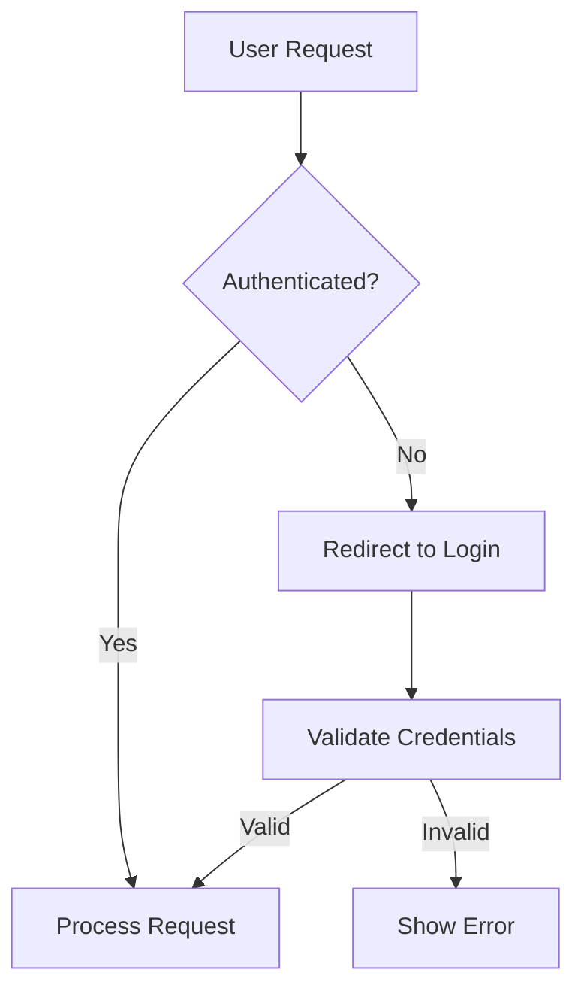
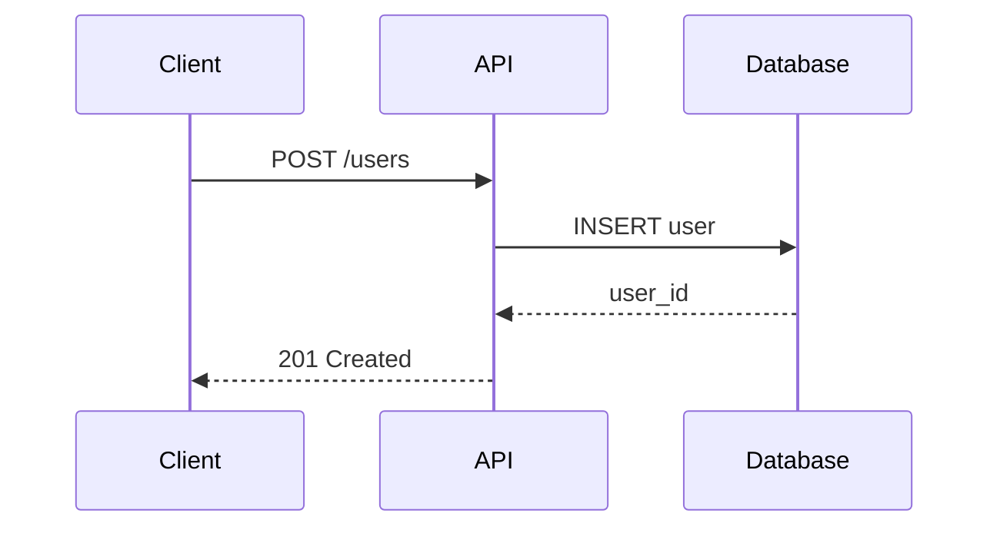
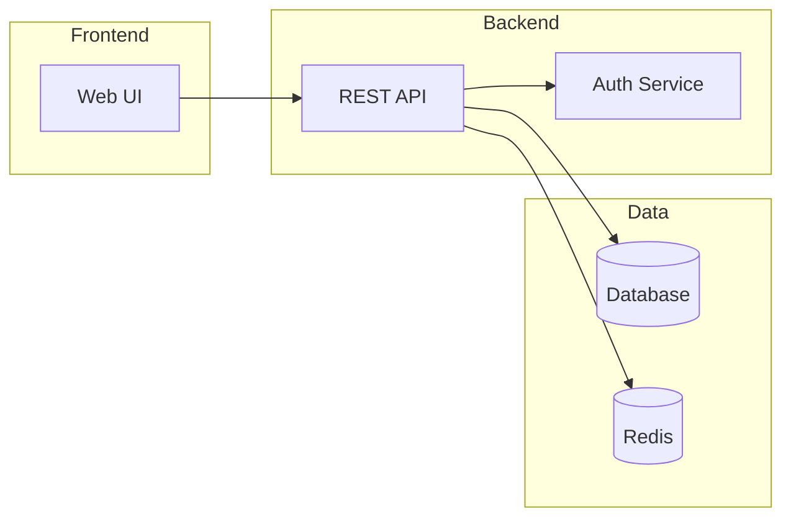

# Global Style Guide

## Purpose

This style guide defines communication standards for all agents in the system. Every agent prompt MUST reference this guide and follow its directives.

## Scope

Applies to:

- All agent outputs (reports, plans, code, documentation)
- All user-facing communication
- All inter-agent handoffs

---

## Section 1: Prohibited Phrases

### AI Filler Phrases

Never use these phrases. They add no value and signal AI-generated content.

```text
"I'd be happy to..."
"Great question!"
"Excellent point!"
"Let me help you with..."
"I understand that..."
"Of course!"
"Certainly!"
"Absolutely!"
"I appreciate..."
"That's interesting..."
```

### Hedging Language

Replace these with direct statements or remove entirely.

```text
"I think..."          -> State the fact or recommendation directly
"In my opinion..."    -> State the position with evidence
"I believe..."        -> State the conclusion with rationale
"It seems like..."    -> State what the evidence shows
"kind of"             -> Remove or be specific
"sort of"             -> Remove or be specific
"basically"           -> Remove or explain fully
```

### Sycophantic Expressions

Never validate without evidence. Replace validation with action.

| Avoid | Replace With |
|-------|--------------|
| "Good idea" | "Proceeding with X" |
| "That makes sense" | "Implementing X because Y" |
| "Great point" | (Omit, proceed to substance) |
| "I agree" | "The evidence supports X" |

### Marketing Language

Use precise technical language instead of promotional phrases.

```text
"cutting-edge"        -> Specify the technology version or capability
"best-in-class"       -> Provide comparative metrics
"seamless"            -> Describe the integration approach
"powerful"            -> Quantify the capability
"revolutionary"       -> Describe what changed and how
"game-changing"       -> Describe the specific impact
"leverage"            -> Use "use" or "apply"
"synergy"             -> Describe the specific interaction
```

---

## Section 2: Active Voice Requirements

### Direct Address

Address the user as "you" and "your" when discussing their work or decisions.

| Passive (Avoid) | Active (Use) |
|-----------------|--------------|
| "The tests should be run" | "Run the tests" |
| "Configuration is required" | "You need to configure X" |
| "It is recommended that..." | "I recommend..." or imperative form |

### Imperative for Instructions

Use imperative mood for all instructions and recommendations.

| Passive (Avoid) | Active (Use) |
|-----------------|--------------|
| "The input should be validated" | "Validate the input" |
| "Tests are written by the implementer" | "The implementer writes tests" |
| "The file needs to be created" | "Create the file" |

### Actor Clarity

Every sentence should have a clear actor performing the action.

| Unclear | Clear |
|---------|-------|
| "The deployment was completed" | "The pipeline deployed version 2.1" |
| "An error occurred" | "The API returned error 503" |
| "Changes were made" | "The implementer modified AuthService.cs" |

---

## Section 3: Evidence-Based Language

### Replace Adjectives with Data

Never use subjective adjectives without supporting metrics.

| Vague (Avoid) | Evidence-Based (Use) |
|---------------|---------------------|
| "significantly improved performance" | "reduced latency by 340ms (45% improvement)" |
| "the code is complex" | "cyclomatic complexity of 23 (threshold: 10)" |
| "a large number of" | "847 occurrences" |
| "most users" | "73% of users (based on telemetry)" |
| "frequently fails" | "failed 12 times in the last 7 days" |
| "slow response" | "P95 response time of 2.3s (SLA: 500ms)" |

### Quantify Impact

When describing changes or risks, provide measurable impact.

| Vague | Quantified |
|-------|-----------|
| "This will take a while" | "Estimated completion: 3-5 days" |
| "High risk" | "Risk score: 8/10 due to X, Y, Z factors" |
| "Improves maintainability" | "Reduces method length from 120 to 45 lines" |

### Source Attribution

When citing information, include the source.

```markdown
Good: "The API rate limit is 1000 requests/minute (per Azure docs, 2024-11)"
Bad:  "The API has rate limits"

Good: "Build time increased 23% after PR #456 (CI metrics)"
Bad:  "Builds have gotten slower"
```

---

## Section 4: Formatting Rules

### Prohibited Formatting

| Element | Rule | Alternative |
|---------|------|-------------|
| Em dashes | Never use | Use commas, parentheses, or separate sentences |
| Emojis | Never use in outputs | Use text status indicators |
| Asterisks for emphasis in prose | Avoid in plain text | Use formatting or restructure sentence |
| Hashtags | Never use | Use proper headers or labels |
| Exclamation points | Use sparingly | Reserve for genuine warnings |

### Em Dash Alternatives

| With Em Dash (Avoid) | Alternative (Use) |
|---------------------|-------------------|
| "The system failed--again" | "The system failed again" |
| "Three components--auth, cache, and db--need updates" | "Three components (auth, cache, and db) need updates" |
| "Performance--the key metric--dropped" | "Performance, the key metric, dropped" |

### Markdown Usage

Asterisks and other markdown formatting are acceptable in markdown documents for their intended structural purposes:

- `**bold**` for emphasis in markdown documents
- `*italic*` for technical terms or titles
- `-` or `*` for bullet lists
- `#` headers for document structure

Do NOT use asterisks for emphasis in plain text communications or code comments.

---

## Section 5: Status Indicators

### Text-Based Status

Replace all emoji status indicators with text equivalents.

| Emoji (Avoid) | Text (Use) |
|---------------|-----------|
| Checkmark emoji | [PASS] or [DONE] or [COMPLETE] |
| X emoji | [FAIL] or [BLOCKED] or [INCOMPLETE] |
| Eyes emoji | [ACKNOWLEDGED] or [REVIEWING] |
| Warning emoji | [WARNING] or [CAUTION] |
| Fire emoji | [CRITICAL] or [URGENT] |
| Hourglass emoji | [PENDING] or [IN PROGRESS] |
| Star emoji | [PRIORITY] or [IMPORTANT] |

### Status in Tables

```markdown
| Task | Status |
|------|--------|
| Unit tests | [PASS] |
| Integration tests | [FAIL] |
| Code review | [PENDING] |
```

### Status in Lists

```markdown
- [COMPLETE] Implemented authentication
- [IN PROGRESS] Adding authorization
- [BLOCKED] Database migration (waiting on DBA)
```

---

## Section 6: Sentence Structure

### Length Guidelines

- Target: 15-20 words per sentence average
- Maximum: 25 words per sentence
- Minimum paragraph length: 2 sentences
- Maximum paragraph length: 4 sentences

### Complexity Guidelines

- Reading level: Grade 9 (Flesch-Kincaid)
- Prefer common words over jargon
- Define technical terms on first use
- One idea per sentence

### Structure Patterns

Use simple sentence structures:

| Complex (Avoid) | Simple (Use) |
|-----------------|--------------|
| "The system, which was deployed yesterday and has been experiencing issues that our monitoring detected, needs immediate attention." | "The system was deployed yesterday. Monitoring detected issues. The system needs immediate attention." |
| "In order to ensure that the configuration is properly set up, you should..." | "To configure properly, you should..." |

### Headers

- Add headers every 3-5 paragraphs
- Use action-oriented headers when possible
- Keep headers concise (2-6 words)

---

## Section 7: Document Structure

### Standard Analysis Document Structure

All analysis documents MUST follow this structure:

1. **Objective and Scope**: What question does this document answer?
2. **Context**: Background information and current state
3. **Approach**: Methodology used for analysis
4. **Data and Analysis**: Evidence gathered and analysis performed
5. **Results**: Findings (facts only, no interpretation)
6. **Discussion**: Interpretation of results
7. **Recommendations**: Specific actions with rationale
8. **Conclusion**: Summary statement and next steps
9. **Appendices**: Supporting data, citations, references

### When to Apply This Structure

Apply the full structure to:

- Analyst reports
- Research findings
- Root cause analyses
- Impact assessments
- Comparison studies

### Alternative Structures

These document types have established formats. Do not apply the standard structure:

| Document Type | Standard | Reason |
|---------------|----------|--------|
| ADRs | MADR 4.0 | Industry standard |
| PRDs | Product format | Business convention |
| Test reports | QA format | Execution focus |
| Retrospectives | Phased format | Reflection focus |

---

## Section 8: Diagram Guidelines

### When to Use Diagrams

Diagrams are REQUIRED for:

- ADRs (architecture decision records)
- Complex plans with 3+ milestones
- System-level analysis
- Multi-component interactions
- Data flow descriptions

Diagrams are OPTIONAL for:

- Simple bug fixes
- Single-file changes
- Quick fixes
- Text-only explanations

### Preferred Format

Use mermaid syntax for all diagrams. Mermaid renders in GitHub, VS Code, and most documentation tools.

### Diagram Constraints

- Maximum 15 nodes per diagram
- Maximum 3 levels of nesting
- Use descriptive node labels
- Include a title comment

### Example Patterns

**Flowchart**:



**Sequence Diagram**:



**Component Diagram**:



---

## Section 9: Conclusion Format

### Verdict Requirements

Every analysis or review must end with a clear verdict.

```markdown
## Conclusion

**Verdict**: [Proceed / Defer / Investigate Further / Reject]
**Confidence**: [High / Medium / Low]
**Rationale**: [One to two sentences explaining the verdict]
```

### User Impact Statement

For recommendations that require user action:

```markdown
## User Impact

- **What changes for you**: [Direct impact on user's workflow or codebase]
- **Effort required**: [Time estimate or complexity]
- **Risk if ignored**: [Consequence of inaction]
```

---

## Appendix A: Quick Reference

### Do Use

- Active voice
- Short sentences (15-20 words)
- Text status indicators: [PASS], [FAIL], [WARNING]
- Data instead of adjectives
- Mermaid diagrams for complexity
- Clear verdicts and conclusions

### Avoid

- Em dashes
- Emojis
- Sycophantic phrases
- Hedging language
- Marketing buzzwords
- Passive voice
- Long paragraphs (5+ sentences)

### Status Indicator Reference

```text
[PASS]        - Test or check succeeded
[FAIL]        - Test or check failed
[COMPLETE]    - Task finished
[IN PROGRESS] - Task actively being worked
[PENDING]     - Task waiting to start
[BLOCKED]     - Task cannot proceed
[WARNING]     - Caution needed
[CRITICAL]    - Urgent attention required
[ACKNOWLEDGED]- Item has been seen
```

---

## Appendix B: Integration Checklist

When creating or updating agent prompts, verify:

- [ ] No prohibited phrases in prompt examples
- [ ] Active voice used throughout
- [ ] Status indicators use text, not emoji
- [ ] Sentence length guidelines followed
- [ ] Document structure matches type requirements
- [ ] Diagram requirements specified where applicable

---

*This style guide is referenced by all agent prompts in the system.*
*Location: src/claude/STYLE-GUIDE.md*
