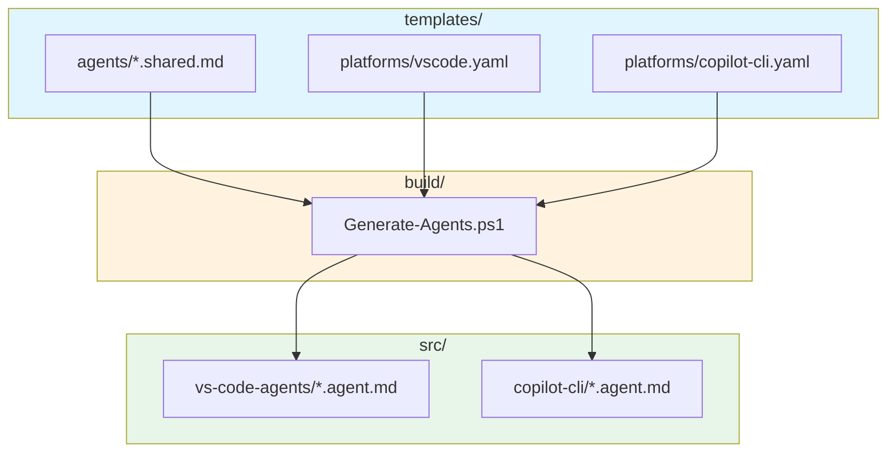
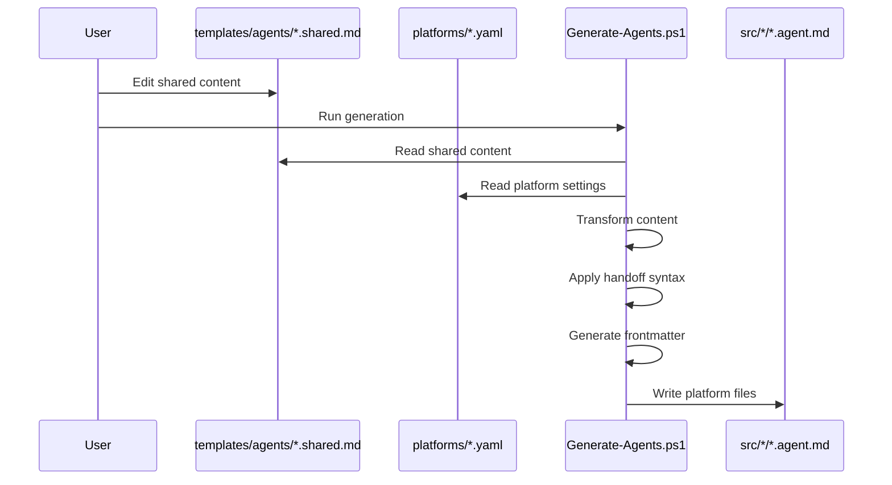

# Template System Agents

This document describes the AI agents defined in the template system and how they are transformed into platform-specific outputs.

## Overview

The `templates/` directory is the **source of truth** for AI agent definitions. It contains shared templates that are transformed by `build/Generate-Agents.ps1` into platform-specific agent files for VS Code and Copilot CLI.

**Important**: Claude Code agents (`src/claude/`) are NOT generated from templates. They are hand-maintained separately. See `src/claude/AGENTS.md` for the Claude agent workflow.

> **Governing ADR**: [ADR-036: Two-Source Agent Template Architecture](../agents/architecture/ADR-036-two-source-agent-template-architecture.md)

## Platform Generation vs Claude Installation

```text
templates/agents/*.shared.md ─────────┐
   (SOURCE for VS Code/Copilot)       │
                                      ▼
                            build/Generate-Agents.ps1
                                      │
              ┌───────────────────────┼───────────────────────┐
              ▼                       ▼                       │
   src/vs-code-agents/*.agent.md  src/copilot-cli/*.agent.md  │
   (GENERATED - DO NOT EDIT)      (GENERATED - DO NOT EDIT)   │
                                                              │
                                                              │
src/claude/*.md ──────────────────────────────────────────────┘
   (HAND-MAINTAINED - separate flow)                          │
                                                              ▼
                                                    scripts/install.ps1
                                                              │
                                                              ▼
                                                   .claude/agents/*.md
                                                   (INSTALLED - runtime)
```

**Key distinction**:

| Directory | Role | Source |
|-----------|------|--------|
| `templates/agents/` | Template for VS Code/Copilot | Hand-maintained |
| `src/vs-code-agents/` | Generated output | From templates |
| `src/copilot-cli/` | Generated output | From templates |
| `src/claude/` | Claude Code source | Hand-maintained (separate) |
| `.claude/agents/` | Claude Code runtime | From src/claude via install |

## Architecture



## Critical Workflow Rules

### Rule 1: Template is Source of Truth (for VS Code/Copilot)

**IMPORTANT**: Never edit generated files directly.

```text
WRONG: Edit src/vs-code-agents/analyst.agent.md directly
RIGHT: Edit templates/agents/analyst.shared.md, then regenerate
```

### Rule 2: Bidirectional Synchronization (CRITICAL - ADR-036)

**The pre-commit hook handles generation but NOT content synchronization between sources.**

Per ADR-036, when adding content that applies to ALL platforms, you MUST update BOTH sources:

| Scenario | Action Required |
|----------|-----------------|
| Universal content added HERE | Also add to `src/claude/{agent}.md` (manual) |
| Universal content added in Claude | Also add to `templates/agents/{agent}.shared.md` |
| Claude-specific content | Do NOT add to templates |
| Template-specific content | Do NOT add to Claude |

**Procedure (from template to Claude):**

```text
1. Edit templates/agents/{agent}.shared.md
2. Edit src/claude/{agent}.md (MANUAL - not auto-synced!)
3. Run: pwsh build/Generate-Agents.ps1
4. Commit all files atomically
```

**Procedure (from Claude to template):**

```text
1. Identify universal changes in src/claude/{agent}.md
2. Duplicate those changes to templates/agents/{agent}.shared.md
3. Run: pwsh build/Generate-Agents.ps1
4. Commit all files atomically
```

**Anti-pattern (ADR-036 §Common Mistake):**

> Editing only `templates/agents/*.shared.md` and forgetting `src/claude/*.md` causes Claude agents to miss the new content while Copilot platforms have it.

See: [src/claude/AGENTS.md](../src/claude/AGENTS.md) for full synchronization rules.

### Rule 3: Regeneration Required After Template Changes

After ANY modification to `templates/`:

```powershell
# Regenerate all platform files
pwsh build/Generate-Agents.ps1

# Validate generation succeeded
pwsh build/Generate-Agents.ps1 -Validate

# Commit template AND generated files together
git add templates/ src/vs-code-agents/ src/copilot-cli/
git commit -m "feat(agents): update {agent} template and regenerate"
```

### Rule 4: Drift Monitoring

Weekly CI (`drift-detection.yml`) checks for semantic drift between:

- Claude agents (`src/claude/`) - hand-maintained
- VS Code agents (`src/vs-code-agents/`) - generated from templates

**Action Required** if drift detected:

1. Review GitHub issue created by CI
2. Determine if drift is intentional or accidental
3. Sync content or document the intentional difference

---

## Agent Catalog

The template system defines 18 specialized AI agents:

| Agent | Role | Primary Use Case |
|-------|------|------------------|
| **orchestrator** | Task coordination | Complex multi-step task routing |
| **analyst** | Research specialist | Root cause analysis, requirements discovery |
| **architect** | Design governance | ADRs, technical decisions, system boundaries |
| **planner** | Work package creation | Epic breakdown, milestones, dependencies |
| **implementer** | Code execution | Production code, tests, implementation |
| **critic** | Plan validation | Pre-implementation review, quality gates |
| **qa** | Test verification | Test strategy, coverage, validation |
| **roadmap** | Strategic vision | Epic definition, prioritization, RICE scoring |
| **devops** | CI/CD specialist | Build automation, deployment, pipelines |
| **security** | Vulnerability assessment | Threat modeling, OWASP, CWE patterns |
| **memory** | Context continuity | Cross-session persistence |
| **skillbook** | Skill management | Learned strategy updates, deduplication |
| **retrospective** | Learning extraction | Outcome analysis, skill extraction |
| **explainer** | Documentation | PRDs, technical specs, feature docs |
| **task-generator** | Task decomposition | Breaking epics into atomic tasks |
| **high-level-advisor** | Strategic decisions | Prioritization, unblocking, direction |
| **independent-thinker** | Assumption challenging | Alternative viewpoints, devil's advocate |
| **pr-comment-responder** | PR review handler | Addressing bot/human review comments |

## Agent Definitions

Each shared agent template (`agents/*.shared.md`) includes:

### Frontmatter Structure

```yaml
---
description: Brief description for agent selection
argument-hint: Guidance for users on what to provide
tools_vscode: ['tool1', 'tool2', ...]    # VS Code tools array
tools_copilot: ['tool1', 'tool2', ...]   # Copilot CLI tools array
---
```

### Content Sections

| Section | Required | Purpose |
|---------|----------|---------|
| `## Core Identity` | Yes | Role description and expertise |
| `## Activation Profile` | Yes | Keywords and summon prompt |
| `## Core Mission` | Yes | Primary objective |
| `## Key Responsibilities` | Yes | Numbered list of responsibilities |
| `## Constraints` | Yes | What the agent should NOT do |
| `## Memory Protocol` | Yes | cloudmcp-manager usage patterns |
| `## Handoff Options` | Yes | When to delegate to other agents |

## Platform Configurations

### VS Code (`platforms/vscode.yaml`)

| Setting | Value | Description |
|---------|-------|-------------|
| `outputDir` | `src/vs-code-agents` | Output directory |
| `fileExtension` | `.agent.md` | File suffix |
| `model` | `Claude Opus 4.5 (anthropic)` | Model field in frontmatter |
| `handoffSyntax` | `#runSubagent` | Agent invocation syntax |

### Copilot CLI (`platforms/copilot-cli.yaml`)

| Setting | Value | Description |
|---------|-------|-------------|
| `outputDir` | `src/copilot-cli` | Output directory |
| `fileExtension` | `.agent.md` | File suffix |
| `includeNameField` | `true` | Includes name in frontmatter |
| `handoffSyntax` | `/agent` | Agent invocation syntax |

## Agent Data Flow



## Dependencies

| Dependency | Type | Purpose |
|------------|------|---------|
| `build/Generate-Agents.ps1` | Script | Transforms templates to outputs |
| `build/Generate-Agents.Common.psm1` | Module | Shared transformation functions |
| PowerShell 7.0+ | Runtime | Script execution |

## Security Considerations

- **Path Validation**: Output paths validated to remain within repository root
- **No External Input**: Templates are static files, not user-generated
- **Review Required**: All template changes go through PR review

## Error Handling

| Scenario | Behavior |
|----------|----------|
| Missing template | Build fails with descriptive error |
| Invalid YAML frontmatter | Parse error with line number |
| Missing platform config | Skip platform, log warning |
| Path traversal attempt | Blocked by path validation |

## Invocation

### Generate All Agents

```powershell
pwsh build/Generate-Agents.ps1
```

### Preview Changes (Dry Run)

```powershell
pwsh build/Generate-Agents.ps1 -WhatIf
```

### Validate Generated Files

```powershell
pwsh build/Generate-Agents.ps1 -Validate
```

## Monitoring

| Check | Mechanism | Frequency |
|-------|-----------|-----------|
| Generation validation | `.github/workflows/validate-generated-agents.yml` | On PR |
| Drift detection | `.github/workflows/drift-detection.yml` | Weekly |
| Content consistency | `build/scripts/Detect-AgentDrift.ps1` | Manual/CI |

## Related Documentation

- [ADR-036: Two-Source Agent Template Architecture](../.agents/architecture/ADR-036-two-source-agent-template-architecture.md) - Governing architecture decision
- [templates/README.md](README.md) - Template usage guide
- [src/claude/AGENTS.md](../src/claude/AGENTS.md) - Claude agent synchronization rules
- [build/AGENTS.md](../build/AGENTS.md) - Build automation agents
- [Root AGENTS.md](../AGENTS.md) - Agent usage instructions
