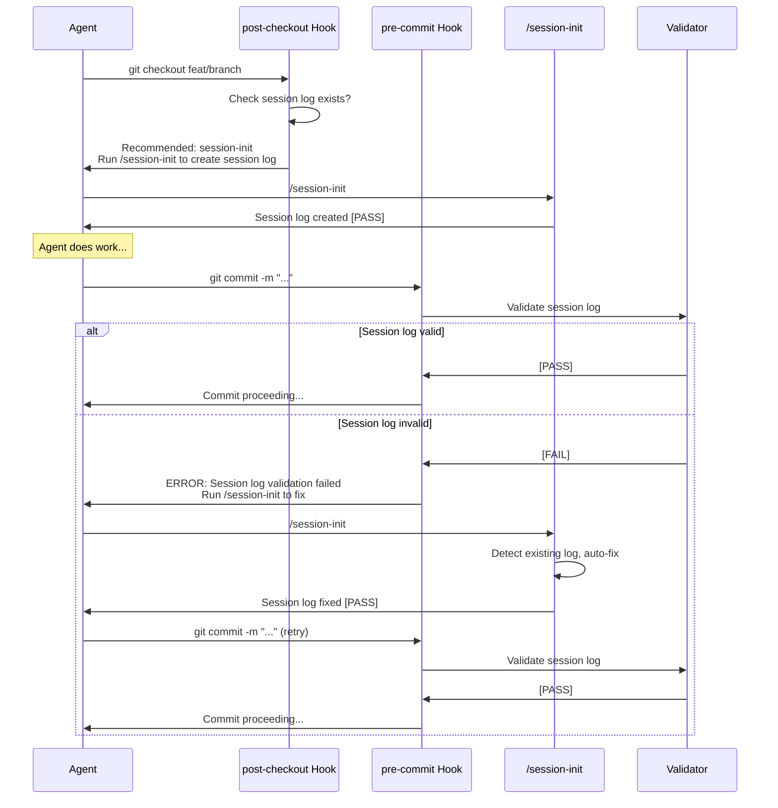

# Core Flows: Optimized Session Initialization

## Overview

This spec defines the user flows for the optimized session initialization workflow, designed to reduce tool calls from 12-15 to 3, eliminate manual corrections, and achieve 100% first-time validation pass rate through automatic detection, phased batching, and multi-checkpoint validation.

## Design Principles

1. **Automatic Discovery**: System detects when agents need session initialization and suggests the optimized workflow
2. **Hook-Based Enforcement**: Multi-layered hooks (post-checkout, pre-commit, Claude Code) ensure compliance
3. **Silent by Default**: Minimal output unless verbose mode is enabled
4. **Self-Healing**: Automatic fixes for common validation failures
5. **Phased Execution**: Clear separation of concerns across 3 tool calls
6. **Verification-Based**: Multiple validation checkpoints prevent invalid states
7. **Skill Recommendation**: System automatically recommends session-init skill in session context

## Flow 1: Hook-Based Prompted Initialization (Primary Path)

**Description**: Agent starts work on a branch, hooks detect missing session log and prompt agent to invoke session initialization.

**Trigger**: Agent checks out a branch or starts a new session.

**Steps**:

1. **post-checkout Hook Triggers**
  - Agent runs: `git checkout feat/new-feature`
  - post-checkout hook executes automatically
  - Hook detects no session log exists for current date
2. **Skill Recommendation (Inform)**
  - Hook displays: "Recommended skill: session-init"
  - Hook shows skill description: "Create protocol-compliant session log with verification"
  - Hook displays: "Run `/session-init` to create session log"
3. **Agent Invocation (Act)**
  - Agent reads recommendation
  - Agent invokes: `/session-init`
  - System proceeds with session-init workflow
4. **Phase 1: Initialization (Tool Call 1)**
  - Initialize Serena MCP
  - Read HANDOFF.md for context
  - Detect git state (branch, commit SHA, status)
  - Auto-detect next session number from existing logs
  - Output: "Initialization complete [PASS]" (silent mode)
5. **Phase 2: Session Log Creation (Tool Call 2)**
  - Prompt agent: "Session objective?"
  - Agent provides objective text
  - Read canonical template from SESSION-PROTOCOL.md
  - **Validation Checkpoint 1**: Verify template structure
  - Auto-populate all evidence fields:
    - Date (YYYY-MM-DD)
    - Session number
    - Branch name
    - Commit SHA (precise format)
    - Git status (clean/dirty)
    - Memory names (from Serena queries)
    - Validator placeholders
  - **Validation Checkpoint 2**: Verify evidence fields
  - Apply path normalization (convert to repo-relative links)
  - **Validation Checkpoint 3**: Final validation before write
  - Write session log file
  - Output: "Session log created [PASS]" (silent mode)
6. **Phase 3: Commit (Tool Call 3)**
  - Run final validation with Validate-SessionProtocol.ps1
  - If PASS: Commit session log
  - Output: "Session log validated and committed [PASS]"
  - Display session log path

**Exit**: Agent has a validated session log ready for work. Total tool calls: 3. Hook prompting ensures agents are reminded to initialize sessions.

---

## Flow 2: Manual Invocation (Alternative Path)

**Description**: Agent explicitly invokes session initialization without hook trigger.

**Trigger**: Agent manually runs `/session-init` command.

**Steps**:

1. **Explicit Invocation**
  - Agent runs: `/session-init`
  - System bypasses detection phase
  - Proceeds directly to Phase 1

```mermaid
sequenceDiagram
    participant Agent
    participant System as Detection System
    participant Init as Phase 1: Init
    participant Create as Phase 2: Create
    participant Commit as Phase 3: Commit
    participant Validator

    Agent->>System: Start session
    System->>Agent: Suggest /session-init
    Agent->>Init: Invoke /session-init
    Init->>Init: Serena + HANDOFF + git state
    Init->>Agent: Initialization [PASS]
    
    Agent->>Create: Continue
    Create->>Agent: Prompt: Objective?
    Agent->>Create: "Implement feature X"
    Create->>Create: Read template
    Create->>Validator: Checkpoint 1 (structure)
    Validator->>Create: [PASS]
    Create->>Create: Auto-fill evidence
    Create->>Validator: Checkpoint 2 (evidence)
    Validator->>Create: [PASS]
    Create->>Create: Path normalization
    Create->>Validator: Checkpoint 3 (final)
    Validator->>Create: [PASS]
    Create->>Create: Write file
    Create->>Agent: Session log created [PASS]
    
    Agent->>Commit: Continue
    Commit->>Validator: Final validation
    Validator->>Commit: [PASS]
    Commit->>Commit: Commit file
    Commit->>Agent: Validated and committed [PASS]
```

---

**Exit**: Agent has a validated session log. Total tool calls: 3.

---

## Flow 3: Session Initialization with Auto-Fix

**Description**: Agent creates session log, validation detects issues, system automatically fixes them and retries.

**Trigger**: Agent invokes `/session-init`, validation checkpoint detects fixable issues.

**Steps**:

1. **Detection and Initialization** (same as Flow 1)
2. **Phase 1: Initialization** (same as Flow 1)
3. **Phase 2: Session Log Creation with Auto-Fix**
  - Prompt agent: "Session objective?"
  - Agent provides objective text
  - Read canonical template from SESSION-PROTOCOL.md
  - **Validation Checkpoint 1**: Verify template structure → [PASS]
  - Auto-populate evidence fields
  - **Validation Checkpoint 2**: Verify evidence fields → [FAIL]
    - Issue detected: Absolute paths in evidence
  - **Auto-Fix Applied**:
    - Convert absolute paths to repo-relative links
    - Re-run Checkpoint 2 → [PASS]
  - Apply path normalization
  - **Validation Checkpoint 3**: Final validation → [PASS]
  - Write session log file
  - Output: "Session log created [PASS] (1 auto-fix applied)" (silent mode)
4. **Phase 3: Commit** (same as Flow 1)

**Exit**: Agent has a validated session log. Auto-fix prevented manual intervention. Total tool calls: 3.

**Auto-Fix Capabilities**:


| Issue Detected              | Auto-Fix Action                          |
| --------------------------- | ---------------------------------------- |
| Absolute paths in evidence  | Convert to repo-relative links           |
| Incorrect commit SHA format | Extract pure SHA from git output         |
| Missing evidence fields     | Populate from git state                  |
| Template header mismatch    | Replace with canonical header text       |
| Path escape characters      | Remove backslashes, normalize separators |


---

## Flow 4: Session Initialization with Verbose Mode

**Description**: Agent requests detailed progress information during session initialization.

**Trigger**: Agent invokes `/session-init --verbose`

**Steps**:

1. **Detection Phase** (same as Flow 1)
2. **Phase 1: Initialization (Verbose)**
  - Output: "Initializing Serena MCP..."
  - Output: "Serena initialized [DONE]"
  - Output: "Reading HANDOFF.md..."
  - Output: "HANDOFF.md loaded [DONE]"
  - Output: "Detecting git state..."
  - Output: "Branch: feat/session-init"
  - Output: "Commit: abc1234"
  - Output: "Status: clean"
  - Output: "Next session number: 812"
  - Output: "Initialization complete [PASS]"
3. **Phase 2: Session Log Creation (Verbose)**
  - Prompt agent: "Session objective?"
  - Agent provides objective text
  - Output: "Reading canonical template from SESSION-PROTOCOL.md..."
  - Output: "Template extracted (lines 494-612) [DONE]"
  - Output: "Validating template structure..."
  - Output: "Template structure [PASS]"
  - Output: "Auto-filling evidence fields..."
  - Output: "Populated: date, session number, branch, commit, git status"
  - Output: "Validating evidence fields..."
  - Output: "Evidence fields [PASS]"
  - Output: "Applying path normalization..."
  - Output: "Path normalization [DONE]"
  - Output: "Final validation..."
  - Output: "Final validation [PASS]"
  - Output: "Writing session log file..."
  - Output: "Session log created [PASS]"
4. **Phase 3: Commit (Verbose)**
  - Output: "Running Validate-SessionProtocol.ps1..."
  - Output: "Protocol validation [PASS]"
  - Output: "Committing session log..."
  - Output: "Commit SHA: def5678"
  - Output: "Session log validated and committed [PASS]"

**Exit**: Agent sees detailed progress at each step. Total tool calls: 3.

---

## Flow 5: pre-commit Hook Enforcement

**Description**: Agent attempts to commit without a validated session log, pre-commit hook blocks and prompts for creation.

**Trigger**: Agent runs `git commit` without a validated session log.

**Steps**:

1. **pre-commit Hook Triggers**
  - Agent runs: `git commit -m "feat: add feature"`
  - pre-commit hook executes automatically
  - Hook runs validation: `pwsh scripts/Validate-SessionProtocol.ps1`
2. **Session Log Missing**
  - Hook detects no session log for current date
  - Hook displays: "ERROR: Session log required. Run `/session-init` to create"
  - Hook blocks commit (exit code 1)
  - Agent invokes: `/session-init`
  - Session log created and validated
  - Agent re-runs: `git commit -m "feat: add feature"`
  - Hook validates → [PASS]
  - Commit proceeds
3. **Session Log Invalid (Fixable)**
  - Hook detects session log exists but validation fails
  - Hook displays: "ERROR: Session log validation failed"
  - Hook displays: "Auto-fixable issues detected. Run `/session-init` to fix"
  - Hook blocks commit (exit code 1)
  - Agent invokes: `/session-init`
  - Script detects existing session log, runs auto-fix
  - Session log validated
  - Agent re-runs commit
  - Hook validates → [PASS]
  - Commit proceeds
4. **Session Log Invalid (Unfixable)**
  - Hook detects unfixable validation failure
  - Hook displays: "ERROR: Unfixable validation issue: [specific error]"
  - Hook displays: "Fix manually or use `--no-verify` to bypass"
  - Hook blocks commit (exit code 1)
  - Agent fixes issue manually or uses `--no-verify`
5. **Bypass with --no-verify**
  - Agent runs: `git commit --no-verify -m "emergency fix"`
  - Hook is bypassed
  - Commit proceeds without session log validation
  - Output: "WARNING: Session log validation bypassed"

**Exit**: Commit proceeds only if session log is validated or --no-verify is used.

---

**Trigger**: Agent invokes `/session-init`, validation checkpoint detects unfixable issue.

**Steps**:

1. **Phase 1: Initialization**
  - Initialize Serena MCP
  - Read HANDOFF.md for context
  - Detect git state → [FAIL]
    - Issue detected: Git repository not found
  - Output: "Validation failed [FAIL]"
  - Output: "Issue: Git repository not found"
  - Output: "Action required: Initialize git repository with `git init`"
  - Output: "Re-run `/session-init` after fixing"
  - Exit with error code
2. **Agent Fixes Issue**
  - Agent runs: `git init`
  - Agent re-invokes: `/session-init`
  - Workflow proceeds successfully (Flow 1 or Flow 2)

**Exit**: Agent resolves unfixable issue and retries. Total tool calls: 3 (after retry).

**Unfixable Issues**:


| Issue                       | Required Action                 |
| --------------------------- | ------------------------------- |
| Git repository not found    | Initialize git with `git init`  |
| SESSION-PROTOCOL.md missing | Restore canonical template file |
| Serena MCP unavailable      | Check Serena configuration      |
| Disk space full             | Free up disk space              |


---

## Flow 7: Claude Code Session Lifecycle Hook

**Description**: Claude Code detects session start and prompts agent to initialize session log.

**Trigger**: Agent starts a new Claude Code session.

**Steps**:

1. **Session Start Detection**
  - Agent starts Claude Code session
  - Claude Code session lifecycle hook executes
  - Hook checks if session log exists for current date
2. **Skill Recommendation**
  - Hook detects no session log exists
  - Hook displays: "Recommended skill: session-init"
  - Hook shows skill description with benefits
  - Hook prompts: "Run `/session-init` to create session log"
3. **Agent Invocation**
  - Agent invokes: `/session-init`
  - Session initialization workflow executes
  - Session log created and validated

**Exit**: Agent has validated session log. Claude Code hook provides session-start enforcement complementary to git hooks.

**Unfixable Issues**:


| Issue                       | Required Action                 |
| --------------------------- | ------------------------------- |
| Git repository not found    | Initialize git with `git init`  |
| SESSION-PROTOCOL.md missing | Restore canonical template file |
| Serena MCP unavailable      | Check Serena configuration      |
| Disk space full             | Free up disk space              |


---

## Hook Enforcement Strategy

### Multi-Layered Hooks


| Hook Type                 | Timing              | Behavior                                                                    | Bypass                |
| ------------------------- | ------------------- | --------------------------------------------------------------------------- | --------------------- |
| **post-checkout**         | After branch switch | Display skill recommendation, prompt agent to run `/session-init`           | N/A (suggestion only) |
| **pre-commit**            | Before commit       | Validate session log, block if invalid, prompt agent to run `/session-init` | `--no-verify`         |
| **Claude Code lifecycle** | Session start       | Detect session context, recommend session-init skill, prompt invocation     | Agent choice          |


### Hook Execution Flow



### Skill Discovery and Recommendation

**Hook-Based Recommendation**:

- Git hooks (post-checkout, pre-commit) detect missing or invalid session log
- Hook displays: "Recommended skill: session-init - Create protocol-compliant session log with verification"
- Hook prompts: "Run `/session-init` to create/fix session log"
- Agent invokes `/session-init` command

**Claude Code Lifecycle Recommendation**:

- Claude Code session start hook detects session context
- Hook displays: "Recommended skill: session-init"
- Hook shows skill description with benefits
- Agent invokes `/session-init` command

**Skill Description** (from session-init skill):

```
Create protocol-compliant session logs with verification-based enforcement.
Prevents recurring CI validation failures by reading canonical template
and validating immediately.

Use when: Starting a new session, creating session log
Outputs: Validated session log file
Benefits: Zero manual corrections, 100% validation pass rate
```

---

## Entry Points Summary


| Entry Point                    | Trigger                                    | Flow                     |
| ------------------------------ | ------------------------------------------ | ------------------------ |
| **post-checkout hook**         | Agent switches branches                    | Flow 1 (prompted)        |
| **Claude Code lifecycle hook** | Agent starts Claude Code session           | Flow 7 (lifecycle)       |
| **Explicit invocation**        | Agent runs `/session-init`                 | Flow 2 (manual)          |
| **Verbose invocation**         | Agent runs `/session-init --verbose`       | Flow 4 (detailed output) |
| **pre-commit hook**            | Agent commits without valid session log    | Flow 5 (enforcement)     |
| **Retry after fix**            | Agent re-runs after fixing unfixable issue | Flow 6 → Flow 1          |


---

---

## Validation Checkpoints Specification

### Checkpoint 1: Template Extraction Validation

**Purpose**: Verify template was correctly extracted from SESSION-PROTOCOL.md

**Validations**:

- Template contains Session Start section with exact header: `### Session Start (COMPLETE ALL before work)`
- Template contains Session End section with exact header: `### Session End (COMPLETE ALL before closing)`
- Template contains Protocol Compliance section
- Template contains Evidence section
- All table structures preserved (headers, rows, columns)

**Pass Criteria**: All required sections present with exact formatting

**Fail Action**: Re-extract template from canonical source

### Checkpoint 2: Variable Replacement Validation

**Purpose**: Verify all placeholders were correctly replaced with actual values

**Validations**:

- All `NN` replaced with session number
- All `YYYY-MM-DD` replaced with current date
- `[branch name]` replaced with actual branch from git
- `[SHA]` replaced with commit SHA (7-12 hex chars)
- `[objective]` replaced with user-provided objective
- `[clean/dirty]` replaced with git status
- No unreplaced placeholders remain

**Pass Criteria**: All variables replaced, no placeholders remain

**Fail Action**: Re-run variable replacement with correct values

### Checkpoint 3: Template Match Validation

**Purpose**: Verify final session log matches canonical template structure exactly

**Validations**:

- Run Validate-SessionProtocol.ps1 on generated content
- All MUST requirements pass
- All evidence fields populated (may be placeholders)
- All paths are repo-relative links
- No path normalization errors ([E_PATH_ESCAPE])

**Pass Criteria**: Validate-SessionProtocol.ps1 exit code 0

**Fail Action**: Apply auto-fixes (path normalization, evidence population), re-validate

---

## Success Metrics


| Metric                          | Target           | Measurement                                  |
| ------------------------------- | ---------------- | -------------------------------------------- |
| Tool calls per session init     | 3                | Count tool invocations                       |
| First-time validation pass rate | 100%             | Validation passes without manual corrections |
| Auto-fix success rate           | 95%+             | Issues resolved without agent intervention   |
| Manual correction rate          | 0%               | No manual edits required                     |
| Token efficiency                | 80-90% reduction | Compare to baseline (12-15 tool calls)       |


---

## Error States and Recovery


| Error State             | Detection          | Recovery                                  |
| ----------------------- | ------------------ | ----------------------------------------- |
| **Template drift**      | Checkpoint 1 fails | Auto-fix: Replace with canonical template |
| **Path normalization**  | Checkpoint 2 fails | Auto-fix: Convert to repo-relative links  |
| **Missing evidence**    | Checkpoint 2 fails | Auto-fix: Populate from git state         |
| **Git not initialized** | Phase 1 fails      | Manual: Run `git init`, retry             |
| **Serena unavailable**  | Phase 1 fails      | Manual: Check Serena config, retry        |
| **Disk space full**     | Phase 2 fails      | Manual: Free disk space, retry            |


---

## Configuration Options

### Command-Line Options


| Option               | Default     | Description                             |
| -------------------- | ----------- | --------------------------------------- |
| `--verbose`          | false       | Enable detailed progress output         |
| `--session-number N` | auto-detect | Override auto-detected session number   |
| `--objective "text"` | prompt      | Provide objective without prompt        |
| `--skip-commit`      | false       | Create and validate but don't commit    |
| `--dry-run`          | false       | Simulate workflow without writing files |


### Hook Configuration

**Configuration File**: `.session-config.json` (version-controlled)

```json
{
  "session": {
    "enforceInit": true,
    "promptOnCheckout": true,
    "blockCommits": true,
    "allowBypass": true
  }
}
```


| Setting            | Default | Description                                     |
| ------------------ | ------- | ----------------------------------------------- |
| `enforceInit`      | true    | Enable hook-based enforcement                   |
| `promptOnCheckout` | true    | Prompt agent to run `/session-init` on checkout |
| `blockCommits`     | true    | Block commits without validated session log     |
| `allowBypass`      | true    | Allow `--no-verify` to bypass hooks             |


### Bypass Mechanism

**Standard bypass** (emergency use):

```
git commit --no-verify -m "emergency fix"
```

**Hook behavior when bypassed**:

- Displays: "WARNING: Session log validation bypassed"
- Commit proceeds without validation
- CI validation will still run (may fail)

---

## Related Specifications

- Epic Brief: spec:a8a106d4-2d31-4e19-ba45-021348587a7e/5312ae6b-3c86-4b02-ae5d-9ae3a14daf8a
- Issue #808: Session-init skill proposal
- SESSION-PROTOCOL.md: Canonical template source
- Validate-SessionProtocol.ps1: Validation script


