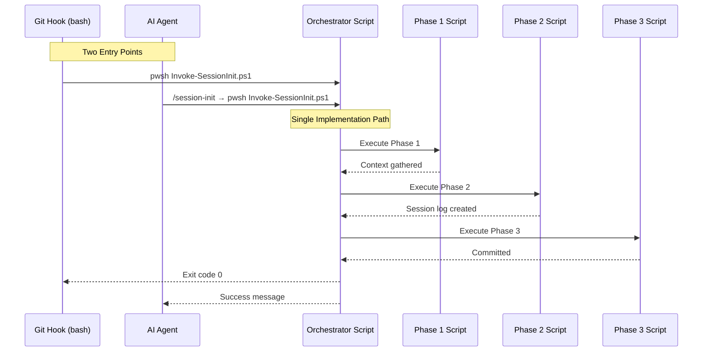
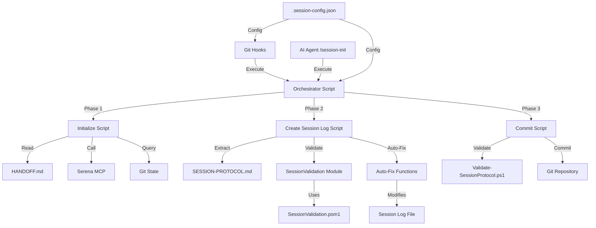
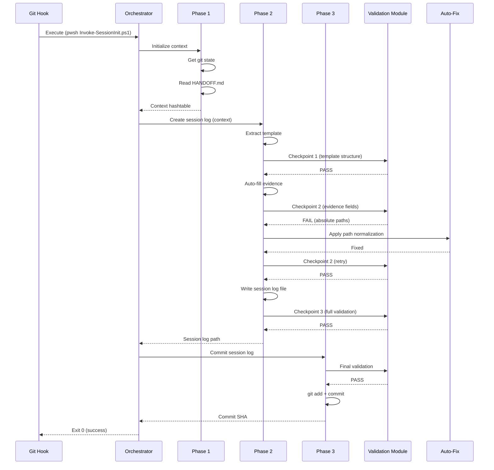

# Tech Plan: Multi-Hook Enforcement and Phased Batching Architecture

## Architectural Approach

### Core Design Decisions

**1. Three-Phase Orchestration with Separate Scripts**

The session initialization workflow is decomposed into three independent, testable phases coordinated by an orchestrator script:

- **Phase 1: Initialize** - Gather context (Serena, HANDOFF, git state)
- **Phase 2: Create Session Log** - Template extraction, evidence auto-fill, validation
- **Phase 3: Commit** - Final validation and git commit

**Rationale**: Separate scripts provide clear boundaries, independent testability, and reusable components. Each phase can be tested in isolation with Pester tests. The orchestrator provides a single entry point while maintaining modularity.

**Trade-off**: More files to maintain vs. better separation of concerns. We accept the additional files for improved testability and maintainability.

---

**2. Granular Validation Module**

Extend the existing file:scripts/modules/SessionValidation.psm1 with checkpoint-specific validation functions:

- `Test-TemplateStructure` - Checkpoint 1: Verify template sections
- `Test-EvidenceFields` - Checkpoint 2: Verify evidence population
- `Invoke-FullValidation` - Checkpoint 3: Call file:scripts/Validate-SessionProtocol.ps1

**Rationale**: Reuses existing validation infrastructure (SessionValidation.psm1) and avoids duplication. The existing file:scripts/Validate-SessionProtocol.ps1 remains unchanged as the authoritative validator. Checkpoint functions provide fast, targeted validation during session log creation.

**Trade-off**: Requires refactoring existing validator to expose granular functions vs. creating separate validators. We choose refactoring to maintain a single source of truth for validation logic.

---

**3. Configuration in .agents/ Directory**

Configuration file location: .agents/.session-config.json

**Rationale**: Logical grouping with other agent artifacts (file:.agents/sessions/, file:.agents/HANDOFF.md, file:.agents/SESSION-PROTOCOL.md). Version-controlled for consistent behavior across all users. JSON format for easy parsing in both PowerShell and bash hooks.

**Trade-off**: Less discoverable than repository root vs. better organization. We accept reduced discoverability for logical grouping and clear ownership.

---

**4. Hybrid Hook Invocation**

Git hooks execute PowerShell scripts directly, while AI agents invoke slash commands that call the same scripts:



**Rationale**: Git hooks need direct script execution for enforcement. AI agents prefer slash commands for discoverability. Both paths converge on the same PowerShell implementation, ensuring consistent behavior.

**Trade-off**: Two invocation paths to maintain vs. flexibility for different contexts. We accept the dual paths for maximum compatibility.

---

**5. File-Based Auto-Fix Pattern**

Follow the existing pre-commit hook auto-fix pattern (file:.githooks/pre-commit lines 102-237):

1. Detect validation failure
2. Apply fix to file on disk
3. Re-run validation
4. Report fix applied

**Rationale**: Consistent with existing codebase patterns (markdown auto-fix, MCP config sync). Proven approach with security hardening (symlink rejection, path validation). Familiar to developers who have used the pre-commit hook.

**Trade-off**: File modification vs. in-memory fixes. We choose file modification for consistency with existing patterns and simpler implementation.

---

**6. Git-Only Evidence Auto-Fill**

Auto-fill evidence fields from git state only:

- Branch name
- Commit SHA (precise format)
- Git status (clean/dirty)
- Date and session number

Memory evidence remains as placeholder: "List memories loaded"

**Rationale**: Avoids Serena MCP dependency in session-init script. Matches current workflow where agents initialize Serena before running session-init. Memory names are filled manually by agents after Serena initialization.

**Trade-off**: Not fully automated vs. no external dependencies. We accept manual memory evidence for simplicity and reliability.

---

### Architectural Constraints

**1. PowerShell-Only Scripting (ADR-005)**

All automation scripts must be PowerShell (.ps1/.psm1). Bash is only used for git hooks as orchestration layer.

**2. Pre-Commit Hook as Validation Orchestration (ADR-004)**

Validation enforcement happens at pre-commit hook. Session-init scripts provide the implementation, hooks provide the enforcement.

**3. Verification-Based Enforcement (Issue #808)**

Session logs must pass validation before commit. No silent fallbacks or skipped validation.

**4. Backward Compatibility**

Existing session logs remain valid. New automation enhances creation workflow without breaking existing logs.

---

### Technology Stack


| Component     | Technology         | Version | Rationale                           |
| ------------- | ------------------ | ------- | ----------------------------------- |
| Scripts       | PowerShell         | 7.4+    | Cross-platform, ADR-005 mandate     |
| Validation    | PowerShell modules | N/A     | Reusable, testable functions        |
| Hooks         | Bash               | N/A     | Git standard, orchestration only    |
| Configuration | JSON               | N/A     | Easy parsing in PowerShell and bash |
| Testing       | Pester             | 5.6+    | PowerShell testing framework        |


---

## Data Model

### Configuration Schema

**File**: .agents/.session-config.json

```json
{
  "$schema": "https://json-schema.org/draft-07/schema#",
  "type": "object",
  "properties": {
    "session": {
      "type": "object",
      "properties": {
        "enforceInit": {
          "type": "boolean",
          "default": true,
          "description": "Enable hook-based enforcement of session initialization"
        },
        "promptOnCheckout": {
          "type": "boolean",
          "default": true,
          "description": "Display session-init recommendation on post-checkout"
        },
        "blockCommits": {
          "type": "boolean",
          "default": true,
          "description": "Block commits without validated session log"
        },
        "allowBypass": {
          "type": "boolean",
          "default": true,
          "description": "Allow --no-verify to bypass hook enforcement"
        }
      },
      "required": ["enforceInit", "promptOnCheckout", "blockCommits", "allowBypass"]
    }
  },
  "required": ["session"]
}
```

**Default Configuration** (committed to repository):

```json
{
  "session": {
    "enforceInit": true,
    "promptOnCheckout": true,
    "blockCommits": true,
    "allowBypass": true
  }
}
```

**Configuration Loading**:

- Scripts use `Get-Content -Raw | ConvertFrom-Json`
- Bash hooks use `jq` for JSON parsing
- Missing config file uses hardcoded defaults

---

### Phase Context Data

**Phase 1 Output** (passed to Phase 2):

```powershell
@{
    # REQUIRED fields (orchestrator validates presence)
    RepoRoot = "/home/user/repo"  # string, must exist
    Branch = "feat/session-init"   # string, non-empty
    Commit = "abc1234"             # string, 7-12 hex chars
    Status = "clean"               # string, "clean" or "dirty"
    
    # OPTIONAL fields (workflow continues if false/missing)
    SerenaInitialized = $true      # bool, default $false
    HandoffRead = $true            # bool, default $false
}
```

**Validation Contract**:

- Orchestrator validates required fields exist and have correct types
- Missing required fields → abort with error
- Optional fields missing → use defaults, continue workflow
- Invalid field types → abort with error

**Phase 2 Output** (passed to Phase 3):

```powershell
@{
    # REQUIRED fields
    SessionLogPath = "/home/user/repo/.agents/sessions/2026-01-07-session-812-session-init.md"  # string, file must exist
    SessionNumber = 812                                    # int, positive
    Objective = "Implement session-init optimization"      # string, non-empty
    
    # OPTIONAL fields
    ValidationCheckpoints = @{                             # hashtable, checkpoint results
        TemplateStructure = "PASS"                         # string, "PASS" or "FAIL"
        EvidenceFields = "PASS"                            # string, "PASS" or "FAIL"
    }
}
```

**Validation Contract**:

- Orchestrator validates SessionLogPath file exists
- SessionNumber must be positive integer
- Objective must be non-empty string
- ValidationCheckpoints optional, used for reporting only

**Phase 3 Output** (returned to caller):

```powershell
@{
    # REQUIRED fields
    Success = $true                                        # bool
    SessionLogPath = "/home/user/repo/.agents/sessions/2026-01-07-session-812-session-init.md"  # string
    CommitSHA = "def5678"                                  # string, 7-40 hex chars
    ValidationResult = "PASS"                              # string, "PASS" or "FAIL"
}
```

**Validation Contract**:

- All fields required for Phase 3 output
- Orchestrator returns this hashtable to caller (hook or agent)
- Exit code matches Success field (0 if true, non-zero if false)

---

### Validation Checkpoint Results

**Checkpoint Result Schema**:

```powershell
@{
    IsValid = $true  # or $false
    Checkpoint = "TemplateStructure"  # or "EvidenceFields" or "FullValidation"
    Errors = @()  # Array of error messages
    Warnings = @()  # Array of warning messages
    FixesApplied = @()  # Array of fix descriptions
}
```

---

### Auto-Fix Action Schema

**Fix Action Structure**:

```powershell
@{
    Type = "PathNormalization"  # or "CommitSHAFormat", "MissingEvidence", etc.
    Description = "Convert absolute paths to repo-relative links"
    OldValue = "C:\Users\user\repo\file.md"
    NewValue = "[file.md](file.md)"
    Applied = $true  # or $false if fix failed
}
```

**Auto-Fix Retry Policy**:

- **Maximum retries per checkpoint**: 2 attempts
- **Fix application**: Iterative (apply one fix, validate, apply next fix, validate)
- **Termination**: After 2 failed attempts, abort with error listing unfixed issues
- **Fix tracking**: Track attempted fixes to prevent duplicate attempts
- **File handling**: Modifications applied to file on disk, no rollback on failure

---

## Component Architecture

### Component Overview



---

### Component 1: Orchestrator Script

**File**: .claude/skills/session-init/scripts/Invoke-SessionInit.ps1

**Responsibilities**:

- Parse command-line arguments (session number, objective, verbose mode)
- Load configuration from .agents/.session-config.json
- Execute phases sequentially
- Pass context between phases
- Handle errors and exit codes
- Display progress messages (silent or verbose)

**Interface**:

```powershell
# Parameters
[int]$SessionNumber       # Optional, auto-detect if not provided
[string]$Objective        # Optional, prompt if not provided
[switch]$Verbose          # Enable detailed output
[switch]$SkipCommit       # Create and validate but don't commit
[switch]$DryRun           # Simulate without writing files

# Exit Codes
0 = Success
1 = Phase 1 failure (git/Serena error)
2 = Phase 2 failure (template/validation error)
3 = Phase 3 failure (commit error)
4 = Configuration error
```

**Dependencies**:

- .claude/skills/session-init/scripts/Initialize-SessionContext.ps1 (Phase 1)
- .claude/skills/session-init/scripts/New-SessionLogFile.ps1 (Phase 2)
- .claude/skills/session-init/scripts/Commit-SessionLog.ps1 (Phase 3)
- .agents/.session-config.json (configuration)

---

### Component 2: Phase 1 - Initialize Script

**File**: .claude/skills/session-init/scripts/Initialize-SessionContext.ps1

**Responsibilities**:

- Detect git repository root
- Query git state (branch, commit SHA, status)
- Check Serena MCP availability (optional)
- Read file:.agents/HANDOFF.md for context
- Auto-detect next session number from existing logs
- Return context hashtable

**Interface**:

```powershell
# Parameters
[switch]$Verbose

# Returns
@{
    RepoRoot = string
    Branch = string
    Commit = string  # Short SHA
    Status = string  # "clean" or "dirty"
    SerenaInitialized = bool
    HandoffRead = bool
}

# Exit Codes
0 = Success
1 = Git repository error
```

**Key Functions**:

- `Get-GitInfo` - Query git state (import from shared module)
- `Test-SerenaAvailability` - Check if Serena MCP is available
- `Get-NextSessionNumber` - Auto-detect from file:.agents/sessions/

**Session Number Auto-Detection Algorithm**:

1. List all files in `.agents/sessions/` matching pattern `YYYY-MM-DD-session-NNN-*.md`
2. Extract session numbers (NNN) from filenames using regex `session-(\d+)`
3. Filter out malformed filenames (non-numeric session numbers)
4. Find maximum session number across **all logs** (not just today's)
5. Return max + 1 as next session number
6. If no logs exist, return 1
7. If extraction fails, prompt user for session number

**Edge Case Handling**:

- Multiple logs same day: Use max + 1 (e.g., 812, 813 exist → next is 814)
- Non-sequential numbers: Use max + 1 (e.g., 810, 812 exist → next is 813, not 811)
- Malformed filenames: Skip and continue (e.g., `session-ABC-test.md` ignored)
- Empty directory: Return 1 as first session number

---

### Component 3: Phase 2 - Create Session Log Script

**File**: .claude/skills/session-init/scripts/New-SessionLogFile.ps1

**Responsibilities**:

- Prompt for session number and objective (if not provided)
- Extract canonical template from file:.agents/SESSION-PROTOCOL.md
- **Checkpoint 1**: Validate template structure
- Auto-fill evidence fields (git state only)
- **Checkpoint 2**: Validate evidence fields
- Apply path normalization
- **Checkpoint 3**: Final validation before write
- Write session log file
- Apply auto-fixes if validation fails

**Interface**:

```powershell
# Parameters
[hashtable]$Context        # From Phase 1
[int]$SessionNumber        # Optional
[string]$Objective         # Optional
[switch]$Verbose

# Returns
@{
    SessionLogPath = string
    SessionNumber = int
    Objective = string
    ValidationCheckpoints = hashtable
}

# Exit Codes
0 = Success
2 = Template extraction failed
3 = Validation failed (unfixable)
```

**Key Functions**:

- `Invoke-TemplateExtraction` - Reuse from existing Extract-SessionTemplate.ps1
- `New-PopulatedSessionLog` - Reuse from existing New-SessionLog.ps1
- `Invoke-CheckpointValidation` - Call validation module functions
- `Invoke-AutoFix` - Apply fixes and retry validation

---

### Component 4: Phase 3 - Commit Script

**File**: .claude/skills/session-init/scripts/Commit-SessionLog.ps1

**Responsibilities**:

- Run final validation with file:scripts/Validate-SessionProtocol.ps1
- Stage session log file (`git add`)
- Commit with conventional commit message
- Return commit SHA

**Interface**:

```powershell
# Parameters
[hashtable]$Context        # From Phase 2
[switch]$Verbose

# Returns
@{
    Success = bool
    SessionLogPath = string
    CommitSHA = string
    ValidationResult = string
}

# Exit Codes
0 = Success
3 = Commit failed
4 = Validation failed
```

**Key Functions**:

- `Invoke-ValidationScript` - Reuse from existing New-SessionLog.ps1
- `Invoke-GitCommit` - Stage and commit session log

---

### Component 5: Validation Module Extensions

**File**: file:scripts/modules/SessionValidation.psm1 (comprehensive refactoring)

**Refactoring Strategy**:

1. **Extract validation logic from Validate-SessionProtocol.ps1**:
  - Move test functions (Test-SessionLogExists, Test-ProtocolComplianceSection, Test-MustRequirements, etc.) into SessionValidation.psm1
  - Keep Validate-SessionProtocol.ps1 as orchestrator that calls module functions
  - Maintain backward compatibility: existing callers of Validate-SessionProtocol.ps1 continue to work
2. **Add checkpoint-specific functions**:
  - `Test-TemplateStructure` - Lightweight check for required sections (Checkpoint 1)
  - `Test-EvidenceFields` - Verify evidence population and format (Checkpoint 2)
  - `Invoke-FullValidation` - Call all validation tests (Checkpoint 3)
3. **Shared validation functions** (extracted from Validate-SessionProtocol.ps1):
  - `Test-RequiredSections` - Verify session log has all required sections
  - `Test-TableStructure` - Verify checklist tables are well-formed
  - `Test-PathNormalization` - Verify all paths are repo-relative
  - `Test-CommitSHAFormat` - Verify commit SHA format (7-40 hex chars)
  - `Test-EvidencePopulation` - Verify evidence fields are non-empty

**New Functions**:

```powershell
function Test-TemplateStructure {
    # Checkpoint 1: Lightweight validation of template structure
    param([string]$Template)
    # Checks: Required sections exist, headers match canonical format
    # Returns: @{ IsValid, Errors, Warnings }
}

function Test-EvidenceFields {
    # Checkpoint 2: Verify evidence fields populated correctly
    param([string]$SessionLog, [hashtable]$GitInfo)
    # Checks: Branch, commit, status populated; paths normalized
    # Returns: @{ IsValid, Errors, Warnings, FixableIssues }
}

function Invoke-FullValidation {
    # Checkpoint 3: Comprehensive validation (all MUST requirements)
    param([string]$SessionLogPath, [string]$RepoRoot)
    # Calls: Test-RequiredSections, Test-MustRequirements, Test-PathNormalization, etc.
    # Returns: @{ IsValid, Errors, Warnings }
}
```

**Integration**:

- Reuses existing functions: `Split-TableRow`, `Parse-ChecklistTable`, `Normalize-Step`, `Test-MemoryEvidence`
- Extracts validation logic from Validate-SessionProtocol.ps1 into reusable functions
- Maintains consistent error reporting format
- Validate-SessionProtocol.ps1 becomes thin orchestrator calling module functions

**Migration Path**:

1. Create new functions in SessionValidation.psm1
2. Refactor Validate-SessionProtocol.ps1 to call module functions (maintain same interface)
3. Add Pester tests for new module functions
4. Verify existing Validate-SessionProtocol.Tests.ps1 still passes
5. Update Phase 2 script to call checkpoint functions directly

---

### Component 6: Auto-Fix Functions

**File**: .claude/skills/session-init/scripts/Repair-SessionLog.ps1

**Responsibilities**:

- Detect fixable validation issues
- Apply fixes to session log file on disk
- Re-run validation after fix
- Report fixes applied

**Auto-Fix Capabilities**:


| Issue                    | Detection                                   | Fix                            |
| ------------------------ | ------------------------------------------- | ------------------------------ |
| Absolute paths           | Regex: `[A-Z]:\` or `/home/` or `/Users/`   | Convert to repo-relative links |
| Commit SHA format        | Regex: `[a-f0-9]{7,12}\s+.+` (with subject) | Extract first token (SHA only) |
| Missing evidence         | Empty evidence cells                        | Populate from git state        |
| Template header mismatch | String comparison                           | Replace with canonical header  |
| Path escape characters   | Regex: `\\` in paths                        | Normalize to forward slashes   |


**Interface**:

```powershell
# Parameters
[string]$SessionLogPath
[hashtable]$ValidationResult
[hashtable]$GitInfo

# Returns
@{
    FixesApplied = array of fix descriptions
    Success = bool
}
```

---

### Component 7: Git Hooks

**File**: .githooks/post-checkout (new)

**Responsibilities**:

- Detect branch checkout
- Check if session log exists for current date
- Display recommendation message if missing
- Execute orchestrator script (optional, based on config)

**Implementation**:

```bash
#!/bin/bash
# Post-checkout hook: Suggest session-init on branch switch

# Load configuration with error handling
CONFIG_FILE=".agents/.session-config.json"
PROMPT_ON_CHECKOUT=true  # Default value

if [ -f "$CONFIG_FILE" ]; then
    # Check if jq is available
    if ! command -v jq &> /dev/null; then
        echo "WARNING: jq not found, using default configuration" >&2
        echo "Install jq for configuration support: apt-get install jq (Linux) or brew install jq (Mac)" >&2
    else
        # Validate JSON and parse
        if jq empty "$CONFIG_FILE" 2>/dev/null; then
            PROMPT_ON_CHECKOUT=$(jq -r '.session.promptOnCheckout // true' "$CONFIG_FILE" 2>/dev/null)
            # Validate boolean value
            if [ "$PROMPT_ON_CHECKOUT" != "true" ] && [ "$PROMPT_ON_CHECKOUT" != "false" ]; then
                echo "WARNING: Invalid promptOnCheckout value in $CONFIG_FILE, using default (true)" >&2
                PROMPT_ON_CHECKOUT=true
            fi
        else
            echo "WARNING: Malformed JSON in $CONFIG_FILE, using default configuration" >&2
            PROMPT_ON_CHECKOUT=true
        fi
    fi
fi

if [ "$PROMPT_ON_CHECKOUT" != "true" ]; then
    exit 0
fi

# Check if session log exists for today
SESSION_DATE=$(date +%Y-%m-%d)
SESSION_LOG_PATTERN=".agents/sessions/${SESSION_DATE}-session-*.md"

if ! ls $SESSION_LOG_PATTERN 1> /dev/null 2>&1; then
    echo "Recommended skill: session-init"
    echo "Create protocol-compliant session log with verification"
    echo ""
    echo "Run: /session-init"
    echo "Or:  pwsh .claude/skills/session-init/scripts/Invoke-SessionInit.ps1"
fi

exit 0
```

---

**File**: file:.githooks/pre-commit (extend existing)

**New Section**: Session Log Validation (add after line 894)

**Responsibilities**:

- Check if session log exists for current date
- Validate session log with file:scripts/Validate-SessionProtocol.ps1
- Block commit if validation fails
- Display fix instructions

**Implementation**:

```bash
# Session Log Validation (blocking)
echo_info "Validating session log..."

SESSION_DATE=$(date +%Y-%m-%d)
SESSION_LOG_PATTERN=".agents/sessions/${SESSION_DATE}-session-*.md"

# Load configuration with error handling
CONFIG_FILE=".agents/.session-config.json"
BLOCK_COMMITS=true  # Default values
ALLOW_BYPASS=true

if [ -f "$CONFIG_FILE" ]; then
    if ! command -v jq &> /dev/null; then
        echo_warn "jq not found, using default configuration"
    else
        if jq empty "$CONFIG_FILE" 2>/dev/null; then
            BLOCK_COMMITS=$(jq -r '.session.blockCommits // true' "$CONFIG_FILE" 2>/dev/null)
            ALLOW_BYPASS=$(jq -r '.session.allowBypass // true' "$CONFIG_FILE" 2>/dev/null)
            # Validate boolean values
            if [ "$BLOCK_COMMITS" != "true" ] && [ "$BLOCK_COMMITS" != "false" ]; then
                echo_warn "Invalid blockCommits value, using default (true)"
                BLOCK_COMMITS=true
            fi
            if [ "$ALLOW_BYPASS" != "true" ] && [ "$ALLOW_BYPASS" != "false" ]; then
                echo_warn "Invalid allowBypass value, using default (true)"
                ALLOW_BYPASS=true
            fi
        else
            echo_warn "Malformed JSON in $CONFIG_FILE, using defaults"
        fi
    fi
fi

if [ "$BLOCK_COMMITS" != "true" ]; then
    echo_info "Session log validation disabled (blockCommits=false)"
    exit 0
fi

# Check if session log exists
if ! ls $SESSION_LOG_PATTERN 1> /dev/null 2>&1; then
    echo_error "Session log required for current date: $SESSION_DATE"
    echo_error "Run: /session-init"
    echo_error "Or:  pwsh .claude/skills/session-init/scripts/Invoke-SessionInit.ps1"
    if [ "$ALLOW_BYPASS" = "true" ]; then
        echo_info "To bypass: git commit --no-verify"
    fi
    exit 1
fi

# Validate session log
SESSION_LOG=$(ls $SESSION_LOG_PATTERN | head -n 1)
pwsh -NoProfile scripts/Validate-SessionProtocol.ps1 -SessionPath "$SESSION_LOG" -Format markdown

if [ $? -ne 0 ]; then
    echo_error "Session log validation failed: $SESSION_LOG"
    echo_error "Fix issues and retry, or run: /session-init"
    if [ "$ALLOW_BYPASS" = "true" ]; then
        echo_info "To bypass: git commit --no-verify"
    fi
    exit 1
fi

echo_success "Session log validated: $SESSION_LOG"
```

---

### Component 8: Slash Command Integration

**File**: file:.claude/commands/session-init.md (existing)

**Update**: Point to orchestrator script

```markdown
# /session-init

Create protocol-compliant session log with verification-based enforcement.

## Usage

```

/session-init  
/session-init --verbose  
/session-init --session-number 812 --objective "Implement feature X"

```

## Implementation

Executes: `pwsh .claude/skills/session-init/scripts/Invoke-SessionInit.ps1`

## Benefits

- Zero manual corrections
- 100% validation pass rate
- Automated evidence population
- Multi-checkpoint validation
- Self-healing auto-fix
```

---

### Component Integration Flow



---

### Testing Strategy

**Unit Tests** (Pester):

- Each phase script tested independently
- Validation module functions tested with sample inputs
- Auto-fix functions tested with known issues
- Configuration loading tested with valid/invalid JSON

**Integration Tests** (Pester):

- Orchestrator calls phases with mocked outputs
- End-to-end workflow with test repository
- Hook execution with test commits

**Test Files**:

- .claude/skills/session-init/tests/Initialize-SessionContext.Tests.ps1
- .claude/skills/session-init/tests/New-SessionLogFile.Tests.ps1
- .claude/skills/session-init/tests/Commit-SessionLog.Tests.ps1
- scripts/modules/SessionValidation.Tests.ps1 (extend existing)
- .claude/skills/session-init/tests/Repair-SessionLog.Tests.ps1

**Test Coverage Target**: 80%+ for all new functions

---

### Performance Targets


| Metric          | Target     | Measurement                                              |
| --------------- | ---------- | -------------------------------------------------------- |
| Tool calls      | 3          | Count orchestrator invocation only (phases are internal) |
| Execution time  | <5 seconds | Time from start to commit                                |
| Validation time | <2 seconds | Time for all 3 checkpoints                               |
| Auto-fix time   | <1 second  | Time to apply fixes                                      |


**Performance Measurement Strategy**:

**Deferred to Post-Implementation**:

- Performance instrumentation will be added after core functionality is working
- Initial focus: Correctness and reliability over performance optimization
- Measurement approach will be determined based on actual implementation

**Proposed Measurement Approach** (for future implementation):

1. Add `Measure-Command` wrappers around phase executions in orchestrator
2. Log timing data to `.agents/sessions/.performance-log.json`
3. Create performance test suite that runs session-init 10 times and validates targets
4. Compare against baseline from Session 811 retrospective (12-15 tool calls)

**Tool Call Counting Clarification**:

- **1 tool call** = 1 orchestrator invocation (from agent or hook perspective)
- Phases are internal implementation details, not separate tool calls
- Target: 12-15 tool calls → 3 tool calls means 3 orchestrator invocations (not 1 orchestrator + 3 phases)

---

### Security Considerations

**1. Path Validation**

- Reject symlinks in session log paths (MEDIUM-002 from file:.githooks/pre-commit)
- Validate paths exist before reading
- Use `-LiteralPath` for file operations

**2. Input Sanitization**

- Validate session number is positive integer
- Sanitize objective text (remove control characters)
- Validate git output before parsing

**3. Configuration Validation**

- Validate JSON schema before loading
- Use default values for missing/invalid settings
- Reject configuration with unexpected keys

**4. Script Execution**

- Use `-NoProfile` when invoking pwsh from hooks
- Quote all variables in bash hooks
- Use `--` separator for git commands

---

### Migration Path

**Phase 1: Core Implementation**

1. Create orchestrator and phase scripts
2. Extend SessionValidation.psm1 with checkpoint functions
3. Create auto-fix script
4. Add Pester tests

**Phase 2: Hook Integration**

1. Create .agents/.session-config.json with defaults
2. Add post-checkout hook
3. Extend pre-commit hook with session log validation
4. Test hook enforcement

**Phase 3: Documentation**

1. Update file:AGENTS.md with new workflow
2. Update file:.agents/SESSION-PROTOCOL.md with automation details
3. Update file:.claude/skills/session-init/SKILL.md
4. Create migration guide for existing users

**Backward Compatibility**:

- Existing session logs remain valid (no retroactive changes required)
- New automation enhances creation workflow without breaking existing logs

**Migration Strategy - New-SessionLog.ps1 Deprecation**:

**Immediate Actions**:

1. Mark file:.claude/skills/session-init/scripts/New-SessionLog.ps1 as **DEPRECATED** in header comments
2. Add deprecation warning when script is executed: "WARNING: This script is deprecated. Use Invoke-SessionInit.ps1 instead."
3. Update `/session-init` slash command to point to `Invoke-SessionInit.ps1`
4. Update all documentation to reference new orchestrator

**Function Extraction**:

- Extract reusable functions from New-SessionLog.ps1 into shared module:
  - `Get-GitInfo` → .claude/skills/session-init/modules/GitHelpers.psm1
  - `Invoke-TemplateExtraction` → Use existing file:.claude/skills/session-init/scripts/Extract-SessionTemplate.ps1
  - `New-PopulatedSessionLog` → .claude/skills/session-init/modules/TemplateHelpers.psm1
- Both old and new scripts import shared modules during transition

**Removal Timeline**:

- **Phase 1 (Immediate)**: Deprecation warning added, documentation updated
- **Phase 2 (After 2 weeks)**: Remove New-SessionLog.ps1 if no issues reported
- **Phase 3 (Cleanup)**: Remove shared module imports from old script location

**Rationale**: Hard cutover minimizes maintenance burden and prevents divergent behavior. Two-week grace period allows users to report issues before permanent removal.

---

### Open Questions

None. All architectural decisions have been validated with the user.
