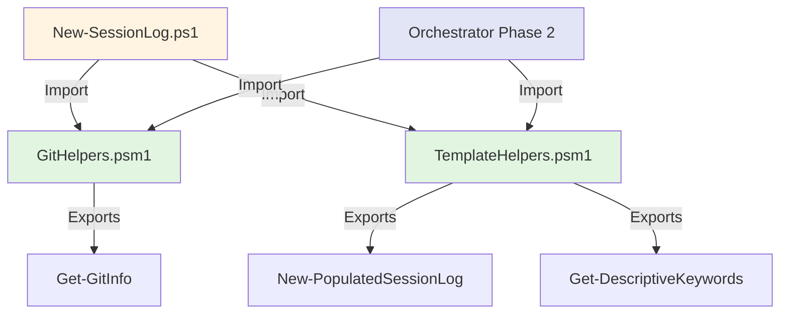

# Implementation Plan: Ticket 2 - Shared Helper Modules

## Objective

Extract reusable functions from file:.claude/skills/session-init/scripts/New-SessionLog.ps1 into shared modules to support both the deprecated script and the new orchestrator during the transition period.

## Context

**Current State**:
- file:.claude/skills/session-init/scripts/New-SessionLog.ps1 is a 695-line monolithic script
- All functions are embedded in the script (Get-GitInfo, New-PopulatedSessionLog, Get-DescriptiveKeywords)
- Commit SHA uses `git log --oneline -1` which returns "SHA subject" format (root cause #3)
- No shared modules exist for session-init functionality

**Desired State**:
- Two new modules: GitHelpers.psm1 and TemplateHelpers.psm1
- Commit SHA uses `git rev-parse --short HEAD` for precise format
- New-SessionLog.ps1 imports and uses shared modules (maintains functionality)
- Modules are reusable by new orchestrator (Ticket 3)

**Dependencies**:
- None (foundation ticket)
- Ticket 3 (Orchestrator) depends on this ticket

## Implementation Strategy

### Module Architecture



### Extraction Strategy

**Phase 1: Create GitHelpers.psm1**
- Extract `Get-GitInfo` function from New-SessionLog.ps1 (lines 61-131)
- Fix commit SHA format issue (use `git rev-parse --short HEAD`)
- Add comprehensive error handling
- Create Pester tests

**Phase 2: Create TemplateHelpers.psm1**
- Extract `New-PopulatedSessionLog` function (lines 271-344)
- Extract `Get-DescriptiveKeywords` function (lines 346-396)
- Add validation and error handling
- Create Pester tests

**Phase 3: Update New-SessionLog.ps1**
- Import both modules
- Replace inline functions with module calls
- Verify existing functionality preserved
- Run existing tests to ensure no regressions

## Step-by-Step Implementation

### Step 1: Create GitHelpers.psm1

**1.1 Create module file**

Location: file:.claude/skills/session-init/modules/GitHelpers.psm1

```powershell
#!/usr/bin/env pwsh


Set-StrictMode -Version Latest
$ErrorActionPreference = 'Stop'

function Get-GitInfo {
    
    [CmdletBinding()]
    param()

    try {
        # Get repository root
        $repoRootOutput = git rev-parse --show-toplevel 2>&1
        if ($LASTEXITCODE -ne 0) {
            $errorDetails = $repoRootOutput -join "`n"
            throw [System.InvalidOperationException]::new(
                "Not in a git repository. Git error (exit code $LASTEXITCODE): $errorDetails`n`nEnsure you are in a git repository by running 'git status'. If you are in a git repository, check for corruption with 'git fsck'."
            )
        }
        $repoRoot = $repoRootOutput.Trim()

        # Get current branch
        $branchOutput = git branch --show-current 2>&1
        if ($LASTEXITCODE -ne 0) {
            $errorDetails = $branchOutput -join "`n"
            throw [System.InvalidOperationException]::new(
                "Failed to get current branch. Git error (exit code $LASTEXITCODE): $errorDetails`n`nThis usually means you are in a detached HEAD state or the repository is corrupted. Run 'git branch --show-current' manually to investigate."
            )
        }
        $branch = $branchOutput.Trim()

        # Get commit SHA (FIXED: use rev-parse instead of log --oneline)
        $commitOutput = git rev-parse --short HEAD 2>&1
        if ($LASTEXITCODE -ne 0) {
            $errorDetails = $commitOutput -join "`n"
            throw [System.InvalidOperationException]::new(
                "Failed to get HEAD SHA. Git error (exit code $LASTEXITCODE): $errorDetails`n`nThis usually means the repository has no commits yet. Create an initial commit with 'git commit --allow-empty -m `"Initial commit`"'."
            )
        }
        $commit = $commitOutput.Trim()

        # Get working tree status
        $statusOutput = git status --short 2>&1
        if ($LASTEXITCODE -ne 0) {
            $errorDetails = $statusOutput -join "`n"
            throw [System.InvalidOperationException]::new(
                "Failed to get git status. Git error (exit code $LASTEXITCODE): $errorDetails`n`nThis indicates repository corruption or permission issues. Run 'git status' manually to investigate."
            )
        }

        $gitStatus = if ([string]::IsNullOrWhiteSpace($statusOutput)) { "clean" } else { "dirty" }

        return @{
            RepoRoot = $repoRoot
            Branch = $branch
            Commit = $commit
            Status = $gitStatus
        }
    } catch [System.InvalidOperationException] {
        # Expected git operation failures - already have detailed messages
        Write-Error $_.Exception.Message
        throw
    } catch {
        # Unexpected errors - provide full diagnostic information
        Write-Error "UNEXPECTED ERROR in Get-GitInfo"
        Write-Error "Exception Type: $($_.Exception.GetType().FullName)"
        Write-Error "Message: $($_.Exception.Message)"
        Write-Error "Stack Trace: $($_.ScriptStackTrace)"
        Write-Error ""
        Write-Error "This is a bug. Please report this error with the above details."
        throw
    }
}

# Export functions
Export-ModuleMember -Function Get-GitInfo
```

**1.2 Key Changes from Original**

| Aspect | Original (New-SessionLog.ps1) | New (GitHelpers.psm1) |
|--------|-------------------------------|----------------------|
| Commit SHA | `git log --oneline -1` | `git rev-parse --short HEAD` |
| Output | "abc1234 Fix bug" | "abc1234" |
| Error Handling | Exit script on error | Throw exception |
| Reusability | Embedded in script | Exported module
