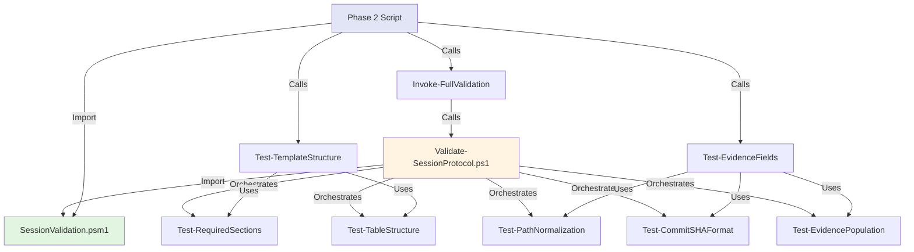

# Implementation Plan: Ticket 1 - Validation Module Refactoring

## Objective

Extract validation logic from file:scripts/Validate-SessionProtocol.ps1 into reusable functions in file:scripts/modules/SessionValidation.psm1 to enable granular checkpoint validation during session log creation.

## Context

**Current State**:
- file:scripts/Validate-SessionProtocol.ps1 is a 1354-line monolithic script with all validation logic embedded
- file:scripts/modules/SessionValidation.psm1 has only 4 helper functions (Split-TableRow, Parse-ChecklistTable, Normalize-Step, Test-MemoryEvidence)
- No checkpoint-specific validation functions exist
- Phase 2 script (to be created in Ticket 3) needs granular validation at 3 checkpoints

**Desired State**:
- SessionValidation.psm1 exports 8+ validation functions (4 existing + 8 new)
- Validate-SessionProtocol.ps1 becomes thin orchestrator calling module functions
- Checkpoint functions enable fast, targeted validation during session log creation
- Backward compatibility maintained (same interface, exit codes, output format)

**Dependencies**:
- None (foundation ticket)
- Ticket 3 (Orchestrator) depends on this ticket

## Implementation Strategy

### Refactoring Approach

**Phase 1: Extract Shared Validation Functions** (from Validate-SessionProtocol.ps1)

Extract these test functions into SessionValidation.psm1:
1. `Test-RequiredSections` - Verify session log has all required sections
2. `Test-TableStructure` - Verify checklist tables are well-formed
3. `Test-PathNormalization` - Verify all paths are repo-relative
4. `Test-CommitSHAFormat` - Verify commit SHA format (7-40 hex chars)
5. `Test-EvidencePopulation` - Verify evidence fields are non-empty

**Phase 2: Create Checkpoint Functions** (new in SessionValidation.psm1)

Create these checkpoint-specific functions:
1. `Test-TemplateStructure` - Checkpoint 1: Lightweight template validation
2. `Test-EvidenceFields` - Checkpoint 2: Evidence field validation with fixable issues
3. `Invoke-FullValidation` - Checkpoint 3: Comprehensive validation (calls Validate-SessionProtocol.ps1)

**Phase 3: Refactor Orchestrator** (Validate-SessionProtocol.ps1)

- Import SessionValidation.psm1
- Replace inline validation logic with module function calls
- Maintain same interface (parameters, exit codes, output format)
- Keep orchestration logic (file discovery, output formatting, CI mode)

### Architecture



## Step-by-Step Implementation

### Step 1: Extract Shared Validation Functions

**1.1 Extract Test-RequiredSections**

Location: file:scripts/Validate-SessionProtocol.ps1 lines 458-550 (Test-SessionLogCompleteness function)

```powershell
function Test-RequiredSections {
    
    [CmdletBinding()]
    param(
        [Parameter(Mandatory)]
        [string]$SessionLogContent
    )
    
    $requiredSections = @(
        '## Session Start',
        '## Session End',
        '## Evidence'
    )
    
    $missingSections = @()
    foreach ($section in $requiredSections) {
        if ($SessionLogContent -notmatch [regex]::Escape($section)) {
            $missingSections += $section
        }
    }
    
    return @{
        IsValid = ($missingSections.Count -eq 0)
        MissingSections = $missingSections
        Errors = if ($missingSections.Count -gt 0) {
            @("Missing required sections: $($missingSections -join ', ')")
        } else { @() }
    }
}
```

**1.2 Extract Test-TableStructure**

Location: file:scripts/Validate-SessionProtocol.ps1 lines 149-209 (ConvertFrom-ChecklistTable function)

```powershell
function Test-TableStructure {
    
    [CmdletBinding()]
    param(
        [Parameter(Mandatory)]
        [string[]]$TableLines
    )
    
    $errors = @()
    
    # Check for header row
    if ($TableLines[0] -notmatch '^\|\s*Req\s*\|') {
        $errors += "Table missing header row (expected: | Req | Step | Status | Evidence |)"
    }
    
    # Check for separator row
    if ($TableLines[1] -notmatch '^\|\s*-+\s*\|') {
        $errors += "Table missing separator row"
    }
    
    # Parse rows using existing Parse-ChecklistTable
    $parsedRows = Parse-ChecklistTable -TableLines $TableLines
    
    # Verify each row has 4 columns
    foreach ($row in $parsedRows) {
        if (-not $row.Req -or -not $row.Step -or -not $row.Status -or -not $row.Evidence) {
            $errors += "Table row missing required columns: $($row.Raw)"
        }
    }
    
    return @{
        IsValid = ($errors.Count -eq 0)
        Errors = $errors
        ParsedRows = $parsedRows
    }
}
```

**1.3 Extract Test-PathNormalization**

Location: file:scripts/Validate-SessionProtocol.ps1 lines 700-800 (path validation logic)

```powershell
function Test-PathNormalization {
    
    [CmdletBinding()]
    param(
        [Parameter(Mandatory)]
        [string]$SessionLogContent
    )
    
    $absolutePathPatterns = @(
        '[A-Z]:\\',           # Windows absolute (C:\)
        '/home/',             # Linux home
        '/Users/'             # macOS home
    )
    
    $absolutePaths = @()
    foreach ($pattern in $absolutePathPatterns) {
        $matches = [regex]::Matches($SessionLogContent, $pattern)
        foreach ($match in $matches) {
            # Extract context (20 chars before and after)
            $start = [Math]::Max(0, $match.Index - 20)
            $length = [Math]::Min(60, $SessionLogContent.Length - $start)
            $context = $SessionLogContent.Substring($start, $length)
            $absolutePaths += $context
        }
    }
    
    return @{
        IsValid = ($absolutePaths.Count -eq 0)
        AbsolutePaths = $absolutePaths
        Errors = if ($absolutePaths.Count -gt 0) {
            @("Found $($absolutePaths.Count) absolute path(s). Use repo-relative paths.")
        } else { @() }
    }
}
```

**1.4 Extract Test-CommitSHAFormat**

Location: file:scripts/Validate-SessionProtocol.ps1 lines 850-900 (Test-GitCommitEvidence function)

```powershell
function Test-CommitSHAFormat {
    
    [CmdletBinding()]
    param(
        [Parameter(Mandatory)]
        [AllowEmptyString()]
        [string]$CommitSHA
    )
    
    # Empty SHA is invalid
    if ([string]::IsNullOrWhiteSpace($CommitSHA)) {
        return @{
            IsValid = $false
            Error = "Commit SHA is empty"
        }
    }
    
    # Check format: 7-40 hex chars only (no subject line)
    if ($CommitSHA -notmatch '^[a-f0-9]{7,40}$') {
        # Check if it's the old format (SHA + subject)
        if ($CommitSHA -match '^[a-f0-9]{7,12}\s+.+') {
            return @{
                IsValid = $false
                Error = "Commit SHA includes subject line. Use SHA only (e.g., 'abc1234' not 'abc1234 Fix bug')"
            }
        }
        return @{
            IsValid = $false
            Error = "Commit SHA format invalid. Expected 7-40 hex chars, got: '$CommitSHA'"
        }
    }
    
    return @{
        IsValid = $true
        Error = $null
    }
}
```

**1.5 Extract Test-EvidencePopulation**

Location: file:scripts/Validate-SessionProtocol.ps1 lines 600-650 (evidence validation logic)

```powershell
function Test-EvidencePopulation {
    
    [CmdletBinding()]
    param(
        [Parameter(Mandatory)]
        [hashtable]$EvidenceFields
    )
    
    $emptyFields = @()
    $placeholderFields = @()
    
    $placeholderPatterns = @(
        '^\[.*\]$',           # Bracketed placeholder [value]
        '^-+$',               # Dashes only
        '^\s*$'               # Empty or whitespace
    )
    
    foreach ($field in $EvidenceFields.Keys) {
        $value = $EvidenceFields[$field]
        
        # Check for empty
        if ([string]::IsNullOrWhiteSpace($value)) {
            $emptyFields += $field
            continue
        }
        
        # Check for placeholder patterns
        foreach ($pattern in $placeholderPatterns) {
            if ($value -match $pattern) {
                $placeholderFields += "$field='$value'"
                break
            }
        }
    }
    
    $errors = @()
    if ($emptyFields.Count -gt 0) {
        $errors += "Empty evidence fields: $($emptyFields -join ', ')"
    }
    if ($placeholderFields.Count -gt 0) {
        $errors += "Placeholder evidence: $($placeholderFields -join ', ')"
    }
    
    return @{
        IsValid = ($errors.Count -eq 0)
        EmptyFields = $emptyFields
        PlaceholderFields = $placeholderFields
        Errors = $errors
    }
}
```

### Step 2: Create Checkpoint Functions

**2.1 Create Test-TemplateStructure (Checkpoint 1)**

```powershell
function Test-TemplateStructure {
    
    [CmdletBinding()]
    param(
        [Parameter(Mandatory)]
        [string]$Template
    )
    
    $errors = @()
    $warnings = @()
    
    # Check required sections exist
    $sectionsResult = Test-RequiredSections -SessionLogContent $Template
    if (-not $sectionsResult.IsValid) {
        $errors += $sectionsResult.Errors
    }
    
    # Check for checklist tables (Session Start and Session End)
    $sessionStartTable = $Template -match '## Session Start.*?\|.*?Req.*?\|'
    $sessionEndTable = $Template -match '## Session End.*?\|.*?Req.*?\|'
    
    if (-not $sessionStartTable) {
        $errors += "Session Start section missing checklist table"
    }
    if (-not $sessionEndTable) {
        $errors += "Session End section missing checklist table"
    }
    
    # Check for Evidence section with table
    $evidenceTable = $Template -match '## Evidence.*?\|.*?\|'
    if (-not $evidenceTable) {
        $warnings += "Evidence section missing table (may be populated later)"
    }
    
    return @{
        IsValid = ($errors.Count -eq 0)
        Checkpoint = "TemplateStructure"
        Errors = $errors
        Warnings = $warnings
    }
}
```

**2.2 Create Test-EvidenceFields (Checkpoint 2)**

```powershell
function Test-EvidenceFields {
    
    [CmdletBinding()]
    param(
        [Parameter(Mandatory)]
        [string]$SessionLog,
        
        [Parameter(Mandatory)]
        [hashtable]$GitInfo
    )
    
    $errors = @()
    $warnings = @()
    $fixableIssues = @()
    
    # Extract evidence section
    $evidenceMatch = [regex]::Match($SessionLog, '## Evidence.*?(?=##|$)', 'Singleline')
    if (-not $evidenceMatch.Success) {
        $errors += "Evidence section not found"
        return @{
            IsValid = $false
            Checkpoint = "EvidenceFields"
            Errors = $errors
            Warnings = $warnings
            FixableIssues = $fixableIssues
        }
    }
    
    $evidenceContent = $evidenceMatch.Value
    
    # Check path normalization
    $pathResult = Test-PathNormalization -SessionLogContent $evidenceContent
    if (-not $pathResult.IsValid) {
        $errors += $pathResult.Errors
        $fixableIssues += @{
            Type = "PathNormalization"
            Description = "Convert absolute paths to repo-relative links"
            AbsolutePaths = $pathResult.AbsolutePaths
        }
    }
    
    # Extract commit SHA from evidence
    $commitMatch = [regex]::Match($evidenceContent, 'Commit:\s*([^\s\n]+)')
    if ($commitMatch.Success) {
        $commitSHA = $commitMatch.Groups[1].Value
        $shaResult = Test-CommitSHAFormat -CommitSHA $commitSHA
        if (-not $shaResult.IsValid) {
            $errors += $shaResult.Error
            $fixableIssues += @{
                Type = "CommitSHAFormat"
                Description = "Extract SHA from 'SHA subject' format"
                OldValue = $commitSHA
            }
        }
    } else {
        $warnings += "Commit SHA not found in Evidence section"
    }
    
    # Check evidence population
    $evidenceFields = @{
        Branch = [regex]::Match($evidenceContent, 'Branch:\s*([^\n]+)').Groups[1].Value
        Commit = [regex]::Match($evidenceContent, 'Commit:\s*([^\n]+)').Groups[1].Value
        Status = [regex]::Match($evidenceContent, 'Status:\s*([^\n]+)').Groups[1].Value
    }
    
    $populationResult = Test-EvidencePopulation -EvidenceFields $evidenceFields
    if (-not $populationResult.IsValid) {
        $errors += $populationResult.Errors
        if ($populationResult.EmptyFields.Count -gt 0) {
            $fixableIssues += @{
                Type = "MissingEvidence"
                Description = "Populate empty evidence fields from git state"
                EmptyFields = $populationResult.EmptyFields
            }
        }
    }
    
    return @{
        IsValid = ($errors.Count -eq 0)
        Checkpoint = "EvidenceFields"
        Errors = $errors
        Warnings = $warnings
        FixableIssues = $fixableIssues
    }
}
```

**2.3 Create Invoke-FullValidation (Checkpoint 3)**

```powershell
function Invoke-FullValidation {
    
    [CmdletBinding()]
    param(
        [Parameter(Mandatory)]
        [string]$SessionLogPath,
        
        [Parameter(Mandatory)]
        [string]$RepoRoot
    )
    
    $validationScript = Join-Path $RepoRoot "scripts/Validate-SessionProtocol.ps1"
    
    if (-not (Test-Path $validationScript)) {
        return @{
            IsValid = $false
            Checkpoint = "FullValidation"
            Errors = @("Validation script not found: $validationScript")
            Warnings = @()
        }
    }
    
    try {
        # Capture output and errors
        $output = & $validationScript -SessionPath $SessionLogPath -Format markdown 2>&1
        $exitCode = $LASTEXITCODE
        
        if ($exitCode -eq 0) {
            return @{
                IsValid = $true
                Checkpoint = "FullValidation"
                Errors = @()
                Warnings = @()
            }
        } else {
            # Parse errors from output
            $errors = $output | Where-Object { $_ -match 'ERROR|FAIL' } | ForEach-Object { $_.ToString() }
            return @{
                IsValid = $false
                Checkpoint = "FullValidation"
                Errors = $errors
                Warnings = @()
            }
        }
    } catch {
        return @{
            IsValid = $false
            Checkpoint = "FullValidation"
            Errors = @("Validation script execution failed: $($_.Exception.Message)")
            Warnings = @()
        }
    }
}
```

### Step 3: Update SessionValidation.psm1

**3.1 Add new functions to module**

Add all 8 functions (5 shared + 3 checkpoint) to file:scripts/modules/SessionValidation.psm1

**3.2 Update Export-ModuleMember**

```powershell
# Export all functions
Export-ModuleMember -Function `
    Split-TableRow, `
    Parse-ChecklistTable, `
    Normalize-Step, `
    Test-MemoryEvidence, `
    Test-RequiredSections, `
    Test-TableStructure, `
    Test-PathNormalization, `
    Test-CommitSHAFormat, `
    Test-EvidencePopulation, `
    Test-TemplateStructure, `
    Test-EvidenceFields, `
    Invoke-FullValidation
```

### Step 4: Refactor Validate-SessionProtocol.ps1

**4.1 Import SessionValidation module**

Add at top of file:

```powershell
# Import validation module
$modulePath = Join-Path $PSScriptRoot "modules/SessionValidation.psm1"
Import-Module $modulePath -Force
```

**4.2 Replace inline validation with module calls**

Example refactoring for Test-SessionLogCompleteness function:

```powershell
# Before (inline validation)
function Test-SessionLogCompleteness {
    param([string]$SessionLogPath, [string]$RepoRoot)
    
    $content = Get-Content -Path $SessionLogPath -Raw
    
    # Check for required sections
    $requiredSections = @('## Session Start', '## Session End', '## Evidence')
    $missingSections = @()
    foreach ($section in $requiredSections) {
        if ($content -notmatch [regex]::Escape($section)) {
            $missingSections += $section
        }
    }
    
    # ... more validation logic ...
}

# After (module call)
function Test-SessionLogCompleteness {
    param([string]$SessionLogPath, [string]$RepoRoot)
    
    $content = Get-Content -Path $SessionLogPath -Raw
    
    # Use module function
    $result = Test-RequiredSections -SessionLogContent $content
    
    if (-not $result.IsValid) {
        return @{
            IsValid = $false
            Errors = $result.Errors
        }
    }
    
    # ... other checks using module functions ...
}
```

**4.3 Maintain same interface**

Ensure Validate-SessionProtocol.ps1 maintains:
- Same parameters (SessionPath, Format, CI, etc.)
- Same exit codes (0 = pass, non-zero = fail)
- Same output format (colored console, markdown, JSON)

### Step 5: Create Pester Tests

**5.1 Create SessionValidation.Tests.ps1**

Location: file:scripts/modules/SessionValidation.Tests.ps1

```powershell
BeforeAll {
    $modulePath = Join-Path $PSScriptRoot "SessionValidation.psm1"
    Import-Module $modulePath -Force
}

Describe "Test-RequiredSections" {
    It "Returns valid when all sections present" {
        $content = @"
## Session Start
## Session End
## Evidence
"@
        $result = Test-RequiredSections -SessionLogContent $content
        $result.IsValid | Should -Be $true
        $result.MissingSections | Should -BeNullOrEmpty
    }
    
    It "Returns invalid when section missing" {
        $content = @"
## Session Start
## Evidence
"@
        $result = Test-RequiredSections -SessionLogContent $content
        $result.IsValid | Should -Be $false
        $result.MissingSections | Should -Contain "## Session End"
    }
}

Describe "Test-CommitSHAFormat" {
    It "Accepts valid short SHA" {
        $result = Test-CommitSHAFormat -CommitSHA "abc1234"
        $result.IsValid | Should -Be $true
    }
    
    It "Accepts valid long SHA" {
        $result = Test-CommitSHAFormat -CommitSHA "abc1234567890abcdef1234567890abcdef1234"
        $result.IsValid | Should -Be $true
    }
    
    It "Rejects SHA with subject line" {
        $result = Test-CommitSHAFormat -CommitSHA "abc1234 Fix bug"
        $result.IsValid | Should -Be $false
        $result.Error | Should -Match "includes subject line"
    }
    
    It "Rejects empty SHA" {
        $result = Test-CommitSHAFormat -CommitSHA ""
        $result.IsValid | Should -Be $false
    }
}

Describe "Test-PathNormalization" {
    It "Accepts repo-relative paths" {
        $content = "[file.md](file.md) and [docs/guide.md](docs/guide.md)"
        $result = Test-PathNormalization -SessionLogContent $content
        $result.IsValid | Should -Be $true
    }
    
    It "Rejects Windows absolute paths" {
        $content = "C:\Users\user\repo\file.md"
        $result = Test-PathNormalization -SessionLogContent $content
        $result.IsValid | Should -Be $false
        $result.AbsolutePaths.Count | Should -BeGreaterThan 0
    }
    
    It "Rejects Linux absolute paths" {
        $content = "/home/user/repo/file.md"
        $result = Test-PathNormalization -SessionLogContent $content
        $result.IsValid | Should -Be $false
    }
}

Describe "Test-TemplateStructure" {
    It "Validates complete template" {
        $template = @"
## Session Start
| Req | Step | Status | Evidence |
|-----|------|--------|----------|
| MUST | Read file | [ ] | - |

## Session End
| Req | Step | Status | Evidence |
|-----|------|--------|----------|
| MUST | Commit | [ ] | - |

## Evidence
| Field | Value |
|-------|-------|
| Branch | main |
"@
        $result = Test-TemplateStructure -Template $template
        $result.IsValid | Should -Be $true
    }
    
    It "Detects missing sections" {
        $template = "## Session Start"
        $result = Test-TemplateStructure -Template $template
        $result.IsValid | Should -Be $false
        $result.Errors | Should -Contain "Missing required sections: ## Session End, ## Evidence"
    }
}

Describe "Test-EvidenceFields" {
    It "Validates populated evidence" {
        $sessionLog = @"
## Evidence
- Branch: feat/test
- Commit: abc1234
- Status: clean
"@
        $gitInfo = @{
            RepoRoot = "/repo"
            Branch = "feat/test"
            Commit = "abc1234"
            Status = "clean"
        }
        
        $result = Test-EvidenceFields -SessionLog $sessionLog -GitInfo $gitInfo
        $result.IsValid | Should -Be $true
    }
    
    It "Detects absolute paths in evidence" {
        $sessionLog = @"
## Evidence
- File: C:\Users\user\repo\file.md
"@
        $gitInfo = @{ RepoRoot = "/repo"; Branch = "main"; Commit = "abc1234"; Status = "clean" }
        
        $result = Test-EvidenceFields -SessionLog $sessionLog -GitInfo $gitInfo
        $result.IsValid | Should -Be $false
        $result.FixableIssues | Should -Not -BeNullOrEmpty
        $result.FixableIssues[0].Type | Should -Be "PathNormalization"
    }
}
```

**5.2 Extend existing Validate-SessionProtocol.Tests.ps1**

Add tests to verify refactored orchestrator still works:

```powershell
Describe "Validate-SessionProtocol.ps1 (Refactored)" {
    It "Maintains same exit code on success" {
        # Create valid session log
        $sessionLog = "..." # Valid content
        $sessionLogPath = "TestDrive:\session.md"
        $sessionLog | Out-File $sessionLogPath
        
        # Run validator
        $result = & "$PSScriptRoot/../Validate-SessionProtocol.ps1" -SessionPath $sessionLogPath
        $LASTEXITCODE | Should -Be 0
    }
    
    It "Maintains same exit code on failure" {
        # Create invalid session log
        $sessionLog = "## Invalid"
        $sessionLogPath = "TestDrive:\session.md"
        $sessionLog | Out-File $sessionLogPath
        
        # Run validator
        $result = & "$PSScriptRoot/../Validate-SessionProtocol.ps1" -SessionPath $sessionLogPath
        $LASTEXITCODE | Should -Not -Be 0
    }
}
```

### Step 6: Verification Checklist

**6.1 Functional Verification**

- [ ] All 8 new functions exported from SessionValidation.psm1
- [ ] Validate-SessionProtocol.ps1 imports module successfully
- [ ] Validate-SessionProtocol.ps1 maintains same interface (parameters, exit codes)
- [ ] Existing session logs validate successfully with refactored script
- [ ] Checkpoint functions return expected hashtable structure

**6.2 Test Coverage Verification**

- [ ] SessionValidation.Tests.ps1 has tests for all 8 new functions
- [ ] Test coverage ≥80% for new functions (run `Invoke-Pester -CodeCoverage`)
- [ ] Existing Validate-SessionProtocol.Tests.ps1 still passes
- [ ] Edge cases covered (empty input, malformed input, missing sections)

**6.3 Backward Compatibility Verification**

- [ ] Run validator on 5 existing session logs from file:.agents/sessions/
- [ ] Verify same validation results (pass/fail) as before refactoring
- [ ] Verify same error messages for known issues
- [ ] Verify same exit codes

**6.4 Performance Verification**

- [ ] Checkpoint 1 (Test-TemplateStructure) completes in 
  
